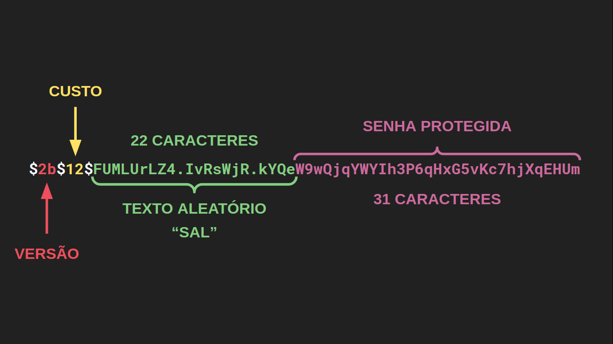

Para saber mais: o funcionamento do bcrypt

Olhando mais atentamente para os valores de senhaHash dos usuários, vemos que o resultado da função bcrypt.hash tem sempre o mesmo formato padrão. Isso é resultado de algumas propriedades específicas do algoritmo para tornar senhas seguras.

O primeiro prefixo, entre cifrões, é a versão do algoritmo. Pode incluir valores como 2b, 2a ou 2y.

Em seguida, temos o custo do algoritmo que nós escolhemos. Quanto maior for esse custo mais demorado será para o algoritmo ser executado e, dessa forma, é mais difícil de ser vítima de ataques de força bruta, onde o atacante experimenta várias senhas na tentativa de encontrar a correta. É importante notar que a cada incremento que nós damos no custo, o algoritmo demora duas vezes mais. E para aplicações modernas, um custo de 12 é considerado suficiente.

Já os 22 caracteres depois do último cifrão formam um texto aleatório, frequentemente apelidado de salt (do inglês “sal”). Esse texto é misturado à senha no algoritmo que gera a senha protegida. Isso dificulta que atacantes consigam pré-computar tabelas de senhas na tentativa de reverter essas funções. O salt é gerado toda vez que chamamos 'bcrypt.hash`, por isso o resultado sempre muda.

Por fim, os últimos 31 caracteres são a senha protegida de fato.

Assim, por causa desse formato, o bcrypt consegue recuperar as informações necessárias para comparar a senha recebida do cliente com a senhaHash do seu usuário, guardada no banco de dados.

custo do bcrypt...

Nessa aula, usamos o bcrypt.hash() para proteger as senhas do usuários. Ela recebe um fator de custo e, para nossa aplicação, usamos um custo de 12. Entretanto, isso pode não ser a melhor opção para o seu caso específico.

Como a própria OWASP (https://cheatsheetseries.owasp.org/cheatsheets/Password_Storage_Cheat_Sheet.html#work-factors) comenta, não existe uma resposta definitiva para o custo ideal. Chegar nesse número depende de fatores como:

* capacidade de processamento da sua máquina;
* razão performance/segurança da sua aplicação;
* tráfego do seu site;
* capacidade computacional da época.

E, mesmo que você precise de segurança, é importante tomar cuidado ao colocar um fator muito maior do que sua máquina suporta pois pode levar a ataques DoS (https://pt.wikipedia.org/wiki/Ataque_de_nega%C3%A7%C3%A3o_de_servi%C3%A7o).

Uma regra geral que a OWASP comenta é que o cálculo de um hash não deve levar mais de um segundo (e bem menos que isso para servidores com alto tráfego).

Você pode testar vários custos na sua máquina executando

const bcrypt = require('bcrypt');    
for (let custo = 6; custo < 18; custo++) {
  const tempoInicial  = Date.now();
  bcrypt.hash('A', custo).then(
    () => console.log(`custo: ${custo}; tempo: ${ Date.now() - tempoInicial} ms`)
  );
}

Com benchmarks de servidores relativamente atuais a gente consegue chegar que um fator entre 12 e 14 é o ideal (de 289ms a 1155ms).
https://github.com/cptwin/Password-Hashing-Algorithm-Benchmark-Tool-PHABT-/blob/master/Results/Xeon%20E3-1275-v3.csv

Mesmo assim, como a Auth0 (https://auth0.com/blog/hashing-in-action-understanding-bcrypt/#L-code-bcrypt--code--Best-Practices) já disse, o processo ideal é realizar uma pesquisa de UX para descobrir o tempo aceitável de espera em registro e login para seus usuários (100ms a 1000ms, num caso geral - https://web.dev/rail/?hl%3Den%23response_respond_in_under_100ms=). Com esse tempo, pegue o maior custo que se aproxime dele na sua máquina.

Se o custo for grande demais, existem alguns mecanismos de defesa de DoS como um sistema proof-of-work.
https://pt.wikipedia.org/wiki/Prova_de_trabalho