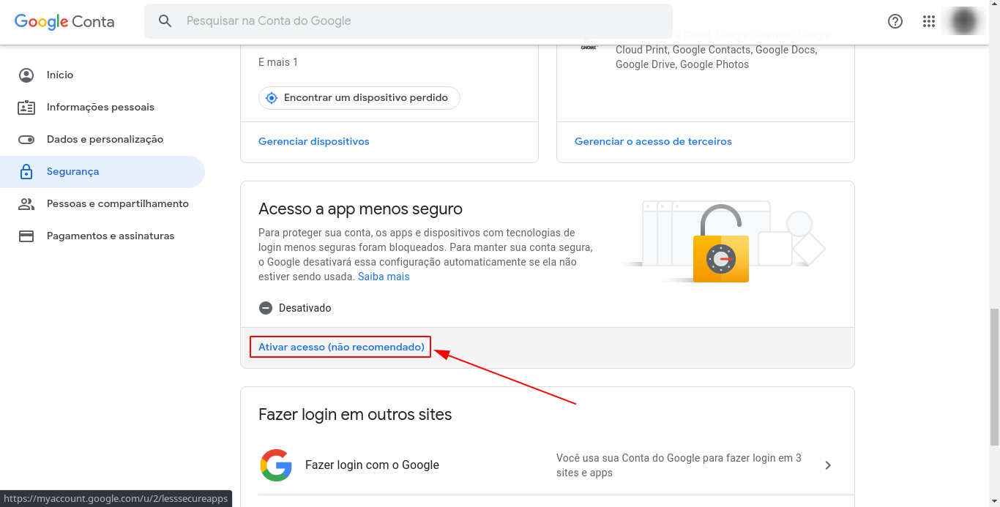
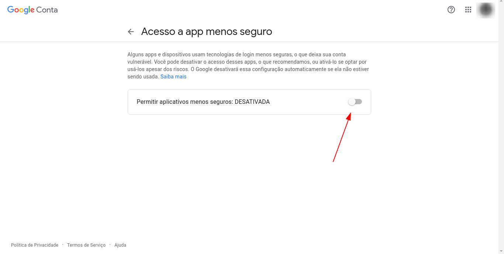
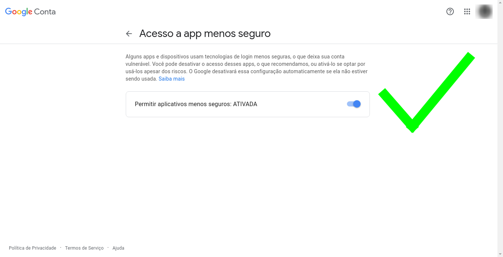
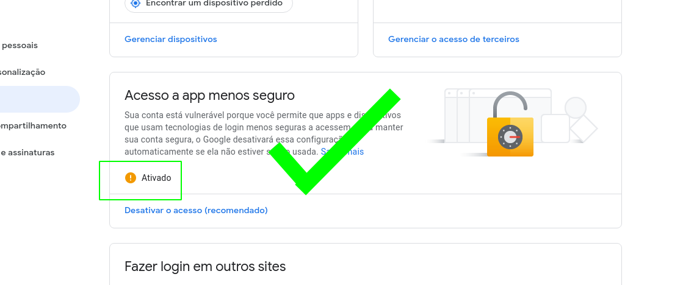
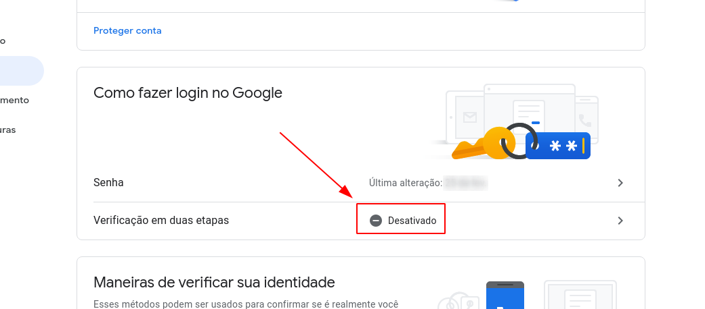
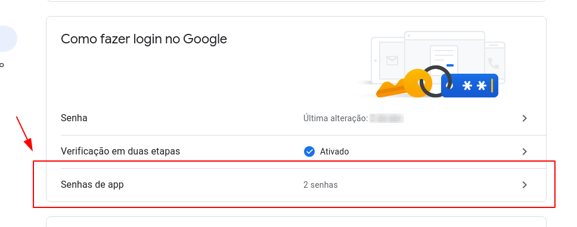
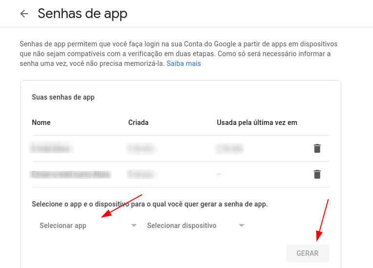
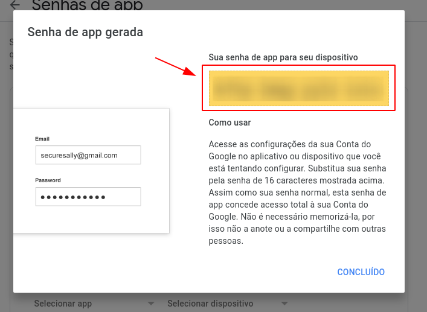
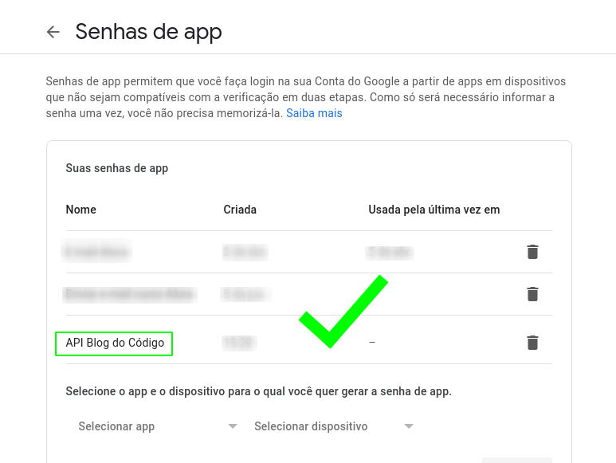

# Como verificar e-mails

[00:00] Para conseguir verificar o endereço de e-mail de um usuário, a primeira coisa que nós precisamos saber é como enviar o e-mail e para isso o que nós vamos usar é um modo do Node chamado nodemailer, vai ser esse módulo que vai nos ajudar no processo de um envio de e-mail de verdade.

[00:19] Então vamos no terminal e importar ele, vamos instalar ele na nossa aplicação com npm install nodemailer@, a versão que nós vamos estar usando no curso, que é 6.4.8. Então vamos esperar ele instalar.

[00:42] Terminou de instalar, então com esse módulo nodemailer, nós vamos criar um novo arquivo. Na pasta “usuarios”, nós vamos criar o arquivo “e-mails.js” e vai ser nele, nesse modulo que nós vamos tratar de toda a lógica de e-mails dentro da nossa aplicação.

[01:00] Então tudo o que tiver relacionado a e-mail, vai ficar aqui dentro. Dessa forma, a primeira coisa que nós fazemos é impor o nodemailer, então: const nodemailer = require(‘nodemailer’) e o que nós queremos fazer é uma função de envio de e-mails.

[01:19] Então vamos criar essa função: function enviaEmail ( ) e esse enviaEmail vai receber o usuario como argumento e o que ele vai fazer é enviar um e-mail para o endereço de e-mail que está cadastrado no usuário.

[01:38] Mas para enviar o e-mail, nós precisamos de uma conta de e-mail, sempre quando eu envio e-mail, eu preciso da minha conta, por exemplo, do Gmail para enviar e-mail para as outras pessoas.

[01:48] Só que como nós estamos na fase de desenvolvimento ainda de uma aplicação, nós queremos ter que ficar enviando e-mail de um lado para o outro ou estar enchendo a caixa de entrada de alguém com vários e-mails de teste e para resolver esse problema, o nodemailer possui um método para criação de uma conta de teste.

[02:06] Assim nós não vamos estar efetivamente enviando e-mail e enchendo a caixa de entrada de alguém, mas nós conseguimos simular o processo de envio de e-mail e conseguir acessar o resultado.

[02:18] O e-mail resultante das operações que nós vamos estar fazendo no nodemailer e isso vai poder ser acessado através de um link que o próprio nodemailer vai gerar para nós. Então nós conseguimos acessar através do navegador.

[02:32] E enquanto nós estivermos desenvolvendo roda a lógica de e-mails, nós vamos estar usando esses e-mails falsos durante o desenvolvimento. Assim, nós vamos criar essa conta teste: const contaTeste, que vai ser o resultado do método createTesteAccount do nodemailer, então: nodemailer.createTeste Account( ).

[02:55] E ele devolve uma promise, então nós colocamos await na função e na declaração de enviaEmail. Dessa forma, com a conta teste criada, o que nós precisamos fazer é criar um objeto que chama transportador, ele é o objeto responsável por enviar o e-mail.

[03:16] E para criar o transportador, nós usamos um método do nodemailer chamado: nodemailer.createTransport e esse resultado, nós colocamos uma variável chamada transportador.

[03:34] E esse createTransport recebe um objeto como argumento e que vai ter vários parâmetros nesse objeto, [ininteligível] dois que nós precisamos colocar é host que vai ser o provedor de e-mail que nós vamos estar utilizando, por exemplo, Gmail é um provedor de e-mail.

[03:53] E a autenticação que nós vamos estar usando também, que é como se nós estivéssemos inserindo e-mail e senha, como se nós estivéssemos fazendo login antes de conseguir enviar e-mail. Como host, nós vamos estar usando o provedor de e-mails teste do nodemailer que se chama smtp.ethereal.email.

[04:24] Toma cuidado com esse endereço de e-mail para não errar e como autenticação, nós vamos usar o próprio objeto da contaTeste que já realiza autenticação para nós e com essas duas informações, nós já conseguimos criar o transportador e enviar e-mails.

[04:43] E para conseguir enviar um e-mail, nós usamos método desse transportador, que é o transportador.sendMail( ) e como argumento desendMail`, nós vamos colocar todas as informações que nós vamos querer que esse e-mail tenha e quais são as informações?

[05:02] Uma delas é o remetente, quem vai estar enviando o e-mail, que nesse caso vai ser o e-mail do Blog do Código, dessa forma o e-mail que o Blog do Código vai usar para enviar e-mail futuramente vai ser esse: from: ‘noreply@blogdocodigo.com.br’.

[05:22] Essa é uma das formatações que você pode colocar como atributo do from, mas se você quiser colocar uma formatação a mais no remetente, você pode deixar o e-mail em parênteses angulares e colocar uma string com o nome que você quer que o usuário veja e nesse caso vai ser Blog do Código: from: ‘“Blog do Código”’ <noreply@blogdocodigo.com.br>'.

[05:44] Então você consegue fazer essa formatação a mais no nome do remetente para não aparecer só o e-mail. Em seguida, a segunda informação que nós precisamos ter no objeto é para quem nós queremos enviar, o to, nosso destinatário e nesse caso vai ser o e-mail do usuário ou pelo menos o e-mail que está cadastrado no usuário: to: usuario.email.

[06:06] Em seguida nós temos que falar do assunto, o subject do e-mail, o título do nosso e-mail, que por enquanto vamos colocar apenas: subject: ‘Teste de e-mail’, mais para frente nós vamos ver quais formatações nós podemos colocar no subject.

[06:24] E a terceira coisa é o corpo do e-mail, que é o atributo text que é nele que nós vamos falar o que nós queremos realmente falar dentro do e-mail, por enquanto nós podemos só dizer: text: ‘Olá! Este é um e-mail de teste!’.

[06:41] E essas são todas as informações essenciais que você vai querer ter dentro do método sendEmail, mas esse método suporta vários outros atributos que você pode conferir tudo isso na documentação do nodemailer e um interessante que tem é o atributo html, que permite a formatação do corpo do nosso e-mail com tags html.

[07:12] Então, por exemplo, nós podemos colocar como um header, como um título e por exemplo: “Esse é um e-mail de teste!”, nós podemos colocar como um parágrafo: html: ‘<h1>Olá!</h1> 
 Este é um e-mail de teste!/<’ e quando nós formos ver ele depois, assim, e-mail enviado, ele vai estar com essa formatação bonita.

[07:38] Então nós executamos o método sendMail do transportador, mas como que nós conseguimos recuperar o e-mail depois? Porque nós não estamos enviando ele para nenhum outro lugar.

[07:50] Esse e-mail: usuario.e-mail não vai receber essa mensagem na caixa de entrada dele, então para recuperar esse e-mail teste que o nodemailer cria, o ethereal, nós primeiro precisamos guardar o resultado da operação: transportador.sendMail.

[08:09] Então nós vamos guardar isso em uma variável info e como isso devolve uma promise, colocamos um await e tendo esse objeto info, nós vamos recuperar o link gerado e vai ser nesse link que nós vamos conseguir acessar o e-mail.

[08:27] Para recuperar o link nós usamos um método do nodemailer chamado getTestMessegeUrl e nós enviamos o info como argumento, então o resultado do: nodemailer.getTestMessageUrl(info) vai ser um link, um endereço que nós vamos poder acessar do nosso navegador e ver o e-mail que resulto a partir disso.

[08:50] E como nós queremos acessar esse link, nós podemos imprimir ele no nosso terminal com console.log(nodemailer.getTestMessageUrl(info), pode imprimir isso e pode colocar URL “Dois pontos”, “Mais” essa “url”: console.log(URL: ‘ + nodemailer.getTestMessageUrl(info)).

[09:07] Então uma das formas que nós vamos criar a nossa função inicial para envio de e-mail e nós podemos exportar isso com o module.exports e objeto que tem o enviaEmail dentro: module.exports = { enviaEmail }.

[09:25] Então para nós testarmos e entendermos como que isso tudo está funcionado, nós podemos ir em “usuarios-controlador.js” e primeiro importar o módulo do e-mails: const emails recebe o require do módulo `(‘./emails’) que está nesse diretório.

[09:43] E nós vamos querer na nossa aplicação, posteriormente, enviar um e-mail em adiciona porque nós vamos querer enviar um e-mail de verificação de e-mail para o usuário.

[09:54] Então logo depois de usuario.adiciona, nós vamos enviar o e-mail com: emails.enviaEmail( ), onde nós enviamos o usuário, como esse método devolve uma promise, nós podemos querer colocar await na frente de emails.enviaEmail(usuario).

[10:10] Mas o envio de e-mail é uma coisa bem lenta em comparação ao resto da execução do controlador e isso não é muito confortável para o usuário, ele pode sentir que a conexão dele está lenta ou que o nosso servidor está mais lento que o normal.

[10:28] Então nós podemos executar isso assincronamente, nós já deixarmos o servidor responder para o usuário dessa forma que o usuário foi criado e nós só capturamos qualquer outro tipo de erro no nosso terminal com console.log, então o e-mail vai ser enviado depois da resposta, mas pelo menos nós conseguimos saber se houve algum erro no nosso terminal.

[10:52] Então o que nós vamos fazer, além do que fazíamos anteriormente é criar o usuário e logo antes de enviar a resposta, nós vamos iniciar a execução de enviaEmail.

[11:05] Então depois de criar o usuário, nós tentamos enviar o e-mail para ele. Então vamos fazer um teste com npm start, executou o servidor e nós vamos no “Insomnia” e tenta fazer uma requisição com o e-mail, por exemplo: “andrew3@alura.com.br”, tem que ser um e-mail que nós não temos ainda.

[11:27] Nós executamos, deu tudo certo, recebi uma resposta que foi criado e se nós voltarmos para o nosso projeto, nós voltarmos para o servidor do nosso projeto, você vai ver que apareceu a “URL”, apareceu uma “URL” impressa no terminal [1787_Aula4.4_Imagem1] e vai ser com essa “URL” que nós vamos conseguir acessar o e-mail gerado pelo nodemailer.

[11:50] Então se nós formos no nosso navegador e colar essa “URL”, nós vamos ter acesso à página do ethereal com uma simulação de como o usuário estaria recebendo esse e-mail [1787_Aula4.4_Imagem2].

[12:08] Então com o título de “Teste de e-mail”, ele vai receber do “Blog do Código”, onde “noreply@blogdocodigo.com.br” é o endereço de e-mail do remetente.

[12:21] No to para quem o Blog do Código está enviando, ou seja, o e-mail do usuário, a data, o ID da mensagem e abaixo o corpo da mensagem: “Olá! Este é um e-mail de teste”.

[12:33] Então esses são os primeiros passos para o envio de um e-mail em Nodejs.

# Enviando e-mails

[00:00] Agora que nós já entendemos como que funciona o processo do envio de envio e-mails, nós podemos pegar e substituir esse objeto de configurações explicito que nós tínhamos feito para o e-mail de teste, pegar isso e substituir pelas informações do e-mail de verificação que vai ser o que nós vamos querer enviar de fato.

[00:18] Então um jeito de fazer isso é nós irmos nos atributos que nós queremos mudar, por exemplo, em subject e substituir, invés de Teste de e-mail, nós colocamos Verificação de e-mail e assim para todos os atributos que nós queremos alterar.

[00:38] Só que dessa forma a nossa função enviaEmail, ela vai acabar enviando só um tipo de e-mail, que é o e-mail de verificação.

[00:48] E isso não é algo tão interessante assim, seria legal se nós conseguíssemos com uma função enviaEmail que pudesse enviar diversos tipos de e-mail porque a única coisa que ia mudar de um para o outro seria esse objeto que nós enviamos no método sendMail do transportador [1787_Aula4.5_Imagem1].

[01:07] E todo o resto seria do mesmo jeito, seria sempre a mesma lógica, só mudando esse objeto [1787_Aula4.5_Imagem2]. Então para nós conseguirmos esse tipo de funcionalidade, nós vamos ter que usar algumas propriedades de orientação objetos.

[01:24] Então para representar esse objeto de configurações que nós enviamos para o sendMail, nós vamos precisar de uma classe, uma classe Email. Então em cima nós vamos criar a classe Email, então cada objeto dessa classe vai ter os atributos com todas as configurações que nós precisamos para enviar e-mail, para enviar como argumento do método sendMail.

[01:51] Então um objeto da classe Email vai ter atributos como o from, to, subject e assim por diante e também um objeto dessa classe Email vai também ter um método de envio de e-mails, que vai ser exatamente a própria função que nós criamos de enviaEmail.

[02:13] Então nós podemos pegar, inserir, recortar e inserir essa função dentro da classe Email [1787_Aula4.5_Imagem3] e transformar ela em um método removendo o function e agora que ela é um método, essa função é um método da classe, nós não precisamos mais declarar explicitamente esse objeto com todos os atributos para configurar o e-mail.

[02:35] E assim nós podemos [ininteligível] o próprio objeto da classe que é o this, então no construtor desse objeto, na hora que ele vai ser instanciado, ele já vai ter todas as configurações necessárias, todos os atributos necessários para esse método onde nós não precisamos declarar nada explicitamente dentro de enviaEmail.

[02:56] E aliás, nós nem precisamos receber o usuário mais e agora que nós temos essa classe e-mail, nós vamos querer agora pensar em como configurar os atributos dos objetos dessa classe e invés de fazer um construtor para essa classe específica, nós vamos fazer o construtor para as subclasses dela.

[03:20] Ou seja, nós vamos ter uma nova classe chamada EmailVerificacao que não vai ser um e-mail qualquer, vai ser os e-mails de verificação de e-mail, que são aqueles que nós estamos querendo enviar agora.

[03:32] E ele vai herdar os atributos da classe Email com extends e nessa classe mesmo, nós vamos criar o constructor e nós aproveitamos e já chamamos o super para herdar todas as instâncias, todas as definições da classe Email, da classe pai.

[03:55] No constructor, nós já podemos começar a definir os atributos que nós queremos, então nós podemos começar com o this.from no remetente, que nós já tínhamos feito anteriormente, que é uma string com ‘“Blog do Código”’, entre “Aspas” e em “Parênteses angulares”noreply@blogdocodigo.com.br`.

[04:19] Em seguida, nós vamos definir o destinatário com o this.to, que vai ser o usuario.email e isso já motiva a nós recebermos esse usuario como argumento do constructor.

[04:38] Então feito o this.from, this.to e agora nós vamos querer o assunto do nosso e-mail: this.subject, que nós já fizemos anteriormente, vai ser: ’Verificação de e-mail’.

[04:53] Feito o assunto e no nosso e-mail nós já vamos querer o conteúdo, o this.text e nós aproveitamos e também já fazemos ao mesmo a implementação do this.html que vai ser o mesmo conteúdo, só que agora formatado com as tags do html.

[05:11] Escrevendo os dois ao mesmo tempo, nós vamos querer algo, o corpo do nosso e-mail vai ter que ser algo com uma introdução inicial, por exemplo: “’Olá!’” e algo que induza o usuário a fazer uma requisição para o nosso servidor de novo, algo como: “’Verifique seu e-mail aqui: ‘“

[05:34] E logo depois daqui, nós vamos enviar para o usuário um endereço para ele realizar a requisição e para fazer isso nós podemos primeiro transformar essa string em this.text e this.html em uma template string e em cada uma das duas linhas, nós vamos inserir uma variável endereco, tanto em this.text, quanto em this.html.

[06:05] E essa variável endereço nós também vamos receber como argumento do constructor, então na hora que o usuário receber esse e-mail, ele vai ter o endereço, aquele endereço gerado aleatoriamente e difícil de chutar.

[06:21] Ele vai receber esse endereço que ele vai ter que fazer questão de volta para o nosso servidor. Então é dessa forma que vai ser estruturado um objeto da classe EmailVerificacao.

[06:34] E nós podemos aproveitar também e só formar um pouco mais o html colocando as tags, heads: <h1>Olá!</h1> e também nós podemos colocar as tags de hyperlink em endereço colocando: <a>${edereco}</a> e um href em endereço, só copiando essa variável {endereço} e colando dentro do href: <a href=”${endereço}”>{endereço}</a>.

[07:05] Ela vai estar formatada quando nós formos olhar o e-mail no ethereal, com essa classe configurada, nós podemos pegar e exportar ela, nós não vamos mais querer exportar ou enviar e-mail porque agora ela está dentro da nossa classe, escondida dentro da classe Email.

[07:21] O que nós vamos querer exportar é só o objeto EmailVerificacao, que é o único que faz sentido dentro da nossa aplicação: module.exports = { EmailVerificacao }.

[07:30] Então com o EmailVerificacao exportado, nós vamos em “usuarios-controlador.js” e em vez de importar o [ininteligível] do mês inteiro, nós podemos só encurtar a classe específica e nós vamos fazer um teste, tentar enviar esse e-mail de verificação para o usuário para ver se está tudo formatado direito.

[07:54] Então, invés de enviar e-mail dessa forma: e-mails.enviaEmail(usuario).catch(console.log), nós vamos apagar e criar primeiro um e-mail de verificações, instanciar uma variável da classe emailVerificacao, que vai ser uma nova instância de EmailVerificacao´, onde vai receber ousuarioe oendereco`.

[08:12] O endereco nós ainda não criamos, mas vamos enviar mesmo assim: const emailVerificacao = new EmailVerificacao(usuario, endereço) e esse e-mail de verificação, o que nós vamos querer chamar o método enviaEmail dele, que vai devolver uma promise.

[08:15] E nós vamos recuperar, nós vamos deixar ela executar assincronamente e qualquer erro que tiver, nós colocamos no nosso terminal, nós colocamos no console.log: emailVerificacao.enviaEmail( ).catch(console.log).

[08:38] Isso já fazia o que nós já queríamos anteriormente, a mesa execução de antes e o que nós só precisamos assegurar é que nós vamos ter algum endereço para enviar para o usuário.

[08:49] O nosso endereço pode ser algo da forma, vamos construir a variável endereço com uma string, onde nós vamos ter a base do nosso endereço, que é o localhost:3000 e vai ser algo na rota do usuario e a sub rota verifica_email: const endereco = ‘localhost:3000/usuario/verifica_email.

[09:15] E em verifica_email, nós vamos precisar de algo para diferenciar uma requisição da outra, o que vai diferenciar quando um usuário, quando dois usuários diferentes fazem requisição para o mesmo endereço.

[09:28] Nós precisamos de algo que quando nós recebermos essa requisição, nós vamos saber sobre qual usuário que fez essa requisição para nós.

[09:37] E um jeito simples de fazer isso é nós usarmos o id do usuario, então usuario.id, enviando usuario.id junto com o endereço, quando ele fizer a requisição para nós, depois de receber no e-mail, nós vamos saber sobre qual usuário está se tratando.

[09:57] Nós conseguimos criar o endereço desse jeito, nós vamos conseguir enviar o e-mail para o usuário, então vamos fazer um teste para ver se está tudo funcionando.

[10:07] Está rodando o servidor Node, então vamos tentar criar um usuário, um usuário que ainda não existe, por exemplo: “andrew4” nesse e-mail. No header o usuário foi criado, aparentemente tudo “ok” e vamos esperar ele enviar o e-mail para nós. Ele está enviando o e-mail para o usuário.

[10:27] Vamos acessar esse e-mail pelo ethereal e apareceu um erro e invés de aparecer: localhost:3000/usuario/verifica_email e o id do usuário, nós recebemos um undefined, invés do id.

[10:41] E como que você acha, por que você acha que nós recebemos um undefined, invés do id? Vamos ver isso no próximo vídeo, mas por que nós recebemos o undefined, invés do id? Pensa aí, que isso vai ser o que nós vamos consertar logo em seguida.

# Enviando e-mails

[00:00] Agora que nós já entendemos como que funciona o processo do envio de envio e-mails, nós podemos pegar e substituir esse objeto de configurações explicito que nós tínhamos feito para o e-mail de teste, pegar isso e substituir pelas informações do e-mail de verificação que vai ser o que nós vamos querer enviar de fato.

[00:18] Então um jeito de fazer isso é nós irmos nos atributos que nós queremos mudar, por exemplo, em subject e substituir, invés de Teste de e-mail, nós colocamos Verificação de e-mail e assim para todos os atributos que nós queremos alterar.

[00:38] Só que dessa forma a nossa função enviaEmail, ela vai acabar enviando só um tipo de e-mail, que é o e-mail de verificação.

[00:48] E isso não é algo tão interessante assim, seria legal se nós conseguíssemos com uma função enviaEmail que pudesse enviar diversos tipos de e-mail porque a única coisa que ia mudar de um para o outro seria esse objeto que nós enviamos no método sendMail do transportador [1787_Aula4.5_Imagem1].

[01:07] E todo o resto seria do mesmo jeito, seria sempre a mesma lógica, só mudando esse objeto [1787_Aula4.5_Imagem2]. Então para nós conseguirmos esse tipo de funcionalidade, nós vamos ter que usar algumas propriedades de orientação objetos.

[01:24] Então para representar esse objeto de configurações que nós enviamos para o sendMail, nós vamos precisar de uma classe, uma classe Email. Então em cima nós vamos criar a classe Email, então cada objeto dessa classe vai ter os atributos com todas as configurações que nós precisamos para enviar e-mail, para enviar como argumento do método sendMail.

[01:51] Então um objeto da classe Email vai ter atributos como o from, to, subject e assim por diante e também um objeto dessa classe Email vai também ter um método de envio de e-mails, que vai ser exatamente a própria função que nós criamos de enviaEmail.

[02:13] Então nós podemos pegar, inserir, recortar e inserir essa função dentro da classe Email [1787_Aula4.5_Imagem3] e transformar ela em um método removendo o function e agora que ela é um método, essa função é um método da classe, nós não precisamos mais declarar explicitamente esse objeto com todos os atributos para configurar o e-mail.

[02:35] E assim nós podemos [ininteligível] o próprio objeto da classe que é o this, então no construtor desse objeto, na hora que ele vai ser instanciado, ele já vai ter todas as configurações necessárias, todos os atributos necessários para esse método onde nós não precisamos declarar nada explicitamente dentro de enviaEmail.

[02:56] E aliás, nós nem precisamos receber o usuário mais e agora que nós temos essa classe e-mail, nós vamos querer agora pensar em como configurar os atributos dos objetos dessa classe e invés de fazer um construtor para essa classe específica, nós vamos fazer o construtor para as subclasses dela.

[03:20] Ou seja, nós vamos ter uma nova classe chamada EmailVerificacao que não vai ser um e-mail qualquer, vai ser os e-mails de verificação de e-mail, que são aqueles que nós estamos querendo enviar agora.

[03:32] E ele vai herdar os atributos da classe Email com extends e nessa classe mesmo, nós vamos criar o constructor e nós aproveitamos e já chamamos o super para herdar todas as instâncias, todas as definições da classe Email, da classe pai.

[03:55] No constructor, nós já podemos começar a definir os atributos que nós queremos, então nós podemos começar com o this.from no remetente, que nós já tínhamos feito anteriormente, que é uma string com ‘“Blog do Código”’, entre “Aspas” e em “Parênteses angulares”noreply@blogdocodigo.com.br`.

[04:19] Em seguida, nós vamos definir o destinatário com o this.to, que vai ser o usuario.email e isso já motiva a nós recebermos esse usuario como argumento do constructor.

[04:38] Então feito o this.from, this.to e agora nós vamos querer o assunto do nosso e-mail: this.subject, que nós já fizemos anteriormente, vai ser: ’Verificação de e-mail’.

[04:53] Feito o assunto e no nosso e-mail nós já vamos querer o conteúdo, o this.text e nós aproveitamos e também já fazemos ao mesmo a implementação do this.html que vai ser o mesmo conteúdo, só que agora formatado com as tags do html.

[05:11] Escrevendo os dois ao mesmo tempo, nós vamos querer algo, o corpo do nosso e-mail vai ter que ser algo com uma introdução inicial, por exemplo: “’Olá!’” e algo que induza o usuário a fazer uma requisição para o nosso servidor de novo, algo como: “’Verifique seu e-mail aqui: ‘“

[05:34] E logo depois daqui, nós vamos enviar para o usuário um endereço para ele realizar a requisição e para fazer isso nós podemos primeiro transformar essa string em this.text e this.html em uma template string e em cada uma das duas linhas, nós vamos inserir uma variável endereco, tanto em this.text, quanto em this.html.

[06:05] E essa variável endereço nós também vamos receber como argumento do constructor, então na hora que o usuário receber esse e-mail, ele vai ter o endereço, aquele endereço gerado aleatoriamente e difícil de chutar.

[06:21] Ele vai receber esse endereço que ele vai ter que fazer questão de volta para o nosso servidor. Então é dessa forma que vai ser estruturado um objeto da classe EmailVerificacao.

[06:34] E nós podemos aproveitar também e só formar um pouco mais o html colocando as tags, heads: <h1>Olá!</h1> e também nós podemos colocar as tags de hyperlink em endereço colocando: <a>${edereco}</a> e um href em endereço, só copiando essa variável {endereço} e colando dentro do href: <a href=”${endereço}”>{endereço}</a>.

[07:05] Ela vai estar formatada quando nós formos olhar o e-mail no ethereal, com essa classe configurada, nós podemos pegar e exportar ela, nós não vamos mais querer exportar ou enviar e-mail porque agora ela está dentro da nossa classe, escondida dentro da classe Email.

[07:21] O que nós vamos querer exportar é só o objeto EmailVerificacao, que é o único que faz sentido dentro da nossa aplicação: module.exports = { EmailVerificacao }.

[07:30] Então com o EmailVerificacao exportado, nós vamos em “usuarios-controlador.js” e em vez de importar o [ininteligível] do mês inteiro, nós podemos só encurtar a classe específica e nós vamos fazer um teste, tentar enviar esse e-mail de verificação para o usuário para ver se está tudo formatado direito.

[07:54] Então, invés de enviar e-mail dessa forma: e-mails.enviaEmail(usuario).catch(console.log), nós vamos apagar e criar primeiro um e-mail de verificações, instanciar uma variável da classe emailVerificacao, que vai ser uma nova instância de EmailVerificacao´, onde vai receber ousuarioe oendereco`.

[08:12] O endereco nós ainda não criamos, mas vamos enviar mesmo assim: const emailVerificacao = new EmailVerificacao(usuario, endereço) e esse e-mail de verificação, o que nós vamos querer chamar o método enviaEmail dele, que vai devolver uma promise.

[08:15] E nós vamos recuperar, nós vamos deixar ela executar assincronamente e qualquer erro que tiver, nós colocamos no nosso terminal, nós colocamos no console.log: emailVerificacao.enviaEmail( ).catch(console.log).

[08:38] Isso já fazia o que nós já queríamos anteriormente, a mesa execução de antes e o que nós só precisamos assegurar é que nós vamos ter algum endereço para enviar para o usuário.

[08:49] O nosso endereço pode ser algo da forma, vamos construir a variável endereço com uma string, onde nós vamos ter a base do nosso endereço, que é o localhost:3000 e vai ser algo na rota do usuario e a sub rota verifica_email: const endereco = ‘localhost:3000/usuario/verifica_email.

[09:15] E em verifica_email, nós vamos precisar de algo para diferenciar uma requisição da outra, o que vai diferenciar quando um usuário, quando dois usuários diferentes fazem requisição para o mesmo endereço.

[09:28] Nós precisamos de algo que quando nós recebermos essa requisição, nós vamos saber sobre qual usuário que fez essa requisição para nós.

[09:37] E um jeito simples de fazer isso é nós usarmos o id do usuario, então usuario.id, enviando usuario.id junto com o endereço, quando ele fizer a requisição para nós, depois de receber no e-mail, nós vamos saber sobre qual usuário está se tratando.

[09:57] Nós conseguimos criar o endereço desse jeito, nós vamos conseguir enviar o e-mail para o usuário, então vamos fazer um teste para ver se está tudo funcionando.

[10:07] Está rodando o servidor Node, então vamos tentar criar um usuário, um usuário que ainda não existe, por exemplo: “andrew4” nesse e-mail. No header o usuário foi criado, aparentemente tudo “ok” e vamos esperar ele enviar o e-mail para nós. Ele está enviando o e-mail para o usuário.

[10:27] Vamos acessar esse e-mail pelo ethereal e apareceu um erro e invés de aparecer: localhost:3000/usuario/verifica_email e o id do usuário, nós recebemos um undefined, invés do id.

[10:41] E como que você acha, por que você acha que nós recebemos um undefined, invés do id? Vamos ver isso no próximo vídeo, mas por que nós recebemos o undefined, invés do id? Pensa aí, que isso vai ser o que nós vamos consertar logo em seguida.

# Configurando o e-mail

[00:00] Vamos então tentar entender porque nós recebemos o undefined em vez do id do usuário como era esperado. Então voltando para o nosso código e se nós analisarmos todo o resto da implementação que nós já fizemos na aplicação.

[00:16] Nós sempre usamos o atributo id do objeto usuario sem pensar muito se nós conseguiríamos acessar ele ou não e isso pode levar a falsa impressão que nós sempre vamos receber algum valor, acessando esse atributo do objeto e isso é sempre verdade com exceção do método adiciona.

[00:41] E por que só nesse método que é diferente? Porque nesse método nós não temos necessariamente todos os atributos que estão no banco de dados porque, primeiro, o objeto é criado a partir apenas do nome e email, que nós recebemos cliente e nós adicionamos em seguida a senha hash com a senha que ele também dá para nós.

[01:06] E logo em seguida nós adicionamos o usuário no bando de dados e só nesse momento que existe algum id atrelado a essas informações, só que mesmo nós adicionando o usuário no banco de dados, o objeto usuário não possui um id, ele não tem as mesmas informações que estão dentro do banco de dados.

[01:26] E é por isso que nós não conseguimos acessar o id, porque nesse momento o usuário só tem três atributos, que é nome, email e a senha hash. Dessa forma, o que nós precisamos é de algum jeito recuperar esse id que está no banco de dados e inserir em usuário.

[01:41] Para isso, vamos em “usuarios-modelo.js” e na função adiciona nós vamos realizar uma busca no banco de dados. Então: ´await usuariosDao.buscaporEmail, que nós enviamos o(this.email)`, que é um atributo que o nosso objeto tem nesse momento.

[02:07] E o resultado dessa busca por e-mail no usuariosDao vai retornar um usuário com as informações de id, nome, email e senha hash. E dessa forma, o que nós queremos é esse id e o que nós podemos fazer é usar a desconstrução do objeto, recuperando o id dessa chamada de função.

[02:32] E recuperando o id, nós podemos inserir no nosso objeto do usuário, então: this.id vai receber essa variável id. Com isso, se nós voltamos para o “usuarios-controlador.js”, nesse momento o “usuarios” vai ter algum valor no atributo id dele e em tese o usuario.id não retornaria undefined.

[02:54] Vamos testar, certificar que está rodando o servidor do Node e realizar uma requisição de criar usuário, agora com usuário diferente e voltando para o código, o usuário foi criado. Vamos esperar o e-mail ser enviado.

[03:10] O e-mail enviado, se nós acessarmos o e-mail com o link, nós vamos ver que agora nós já sabemos o localhost:3000/usuario/verifica_email/6 e o id que no caso é “6”.

[03:22] Agora nós temos acesso ao id do usuário, ele é impresso da maneira correta no e-mail e isso vai permitir que nós agora voltemos para o nosso código e reveja a maneira que nós geramos o endereço dentro do controlador.

[03:37] Se nós formos no código, nós vemos que o nosso endereço é gerado coma string é a concatenação dessa string: ’localhost:300/usuario/verifica_ email/ com o isuario.id.

[03:46] Só que se nós pensarmos bem, isso é um pouco problemático porque localhost:3000 é um endereço que só vai funcionar em ambiente de desenvolvimento, mais especificamente no nosso ambiente agora e por exemplo em produção, isso vai ser um endereço completamente diferente, podendo ser o endereço do Blog do Código.

[04:07] Dessa forma é interessante nós encapsularmos esse tipo de geração de endereço de forma que nós consigamos facilitar a mudança de qualquer um desses parâmetros aqui, tanto a base do nosso endereço, a rota e o id do usuário. [04:26] Dessa forma, o que nós queremos é uma função: fuction geraEndereco e essa função vai receber a rota, que é por exemplo aqui: usuario/verifica_email e vai receber o id do usuário, por exemplo: usuario.id.

[04:49] E o que vai fazer? Retornar o endereço a partir dessas duas informações (rota, id). Então para gerar o endereço, nós precisamos da nossa base da “URL” que vai estar em todas as nossas rotas, aqui no nosso caso, por enquanto: const baseURL = ‘localhost:3000’ essa é a base da nossa URL até agora.

[05:14] E o que nós vamos retornar vai ser uma template string com as variáveis baseURL, a variável rota e a variável id: return${baseURL}${rota}${id}`.

[05:26] Então vai ser uma concatenação dessas três variáveis. Dessa forma invés de declarar explicitamente essa string.

[05:36] O que nós podemos fazer é apenas chamar a função geraEndereco com a rota que é (‘/usuario/verifica_email/’) eusario.id:const endereço = geraEndereco(‘/usuario/verifica_email/’, usuario.id)`.

[05:57] Assim, o endereço vai ser gerado nesse mesmo formato e isso facilita quem está programando o método adiciona não precisa necessariamente saber se nós estamos em ambiente de desenvolvimento ou programação, ele só vai saber sobre a rota e o id do usuário.

[06:16] E além disso, nós temos como deixar essa transição de desenvolvimento e produção de uma forma mais fácil, colocando essa informação, a nossa base URL em uma variável de ambiente.

[06:30] Dessa forma, se nós formos no nosso arquivo “.env”, nós podemos criar em uma nova variável de [ininteligível]: BASE_URL que vai ter o conteúdo de ”localhost:3000”.

[06:50] Em “usuarios-controlador.js”, invés de declarar explicitamente: const baseURL = ‘localhost:3000’, nós podemos acessar com process.env.BASE_URL. Assim, para alterar entre desenvolvimento e programação, nós não precisamos caçar no código onde nós escrevemos localhost.

[07:09] É só pegar e mudar essa variável de ambiente e invés de localhost:3000, o endereço de verdade que nós vamos estar “hosteando” do Blog do Código. Vamos fazer mais um teste com o servidor do Node rodando.

[07:27] Vamos tentar criar um outro usuário. A requisição funcionou tudo certo, vamos esperar o e-mail ser enviado. O e-mail foi enviado e acessando esse e-mail, nós vamos ver que acontece da mesma forma, mesmo padrão que nós tínhamos feito antes.

[07:45] Deu tudo certo e é dessa forma que nós conseguimos criar um e-mail de verificação para o Blog do Código, nós podemos começar a construir as rotas para verificação do e-mail.

# Nodemailer

Para modificar o envio de e-mails de acordo com sua aplicação, é sempre bom consultar a documentação do Nodemailer (https://nodemailer.com/about/). Lá você pode encontrar todas as opções de configuração de um transportador SMPT (https://nodemailer.com/smtp/) (o que usamos no curso) e até de outros tipos de transportadores(https://nodemailer.com/transports/). Além disso, você pode conferir todas as configurações de mensagens(https://nodemailer.com/message/), como o envio de anexos(https://nodemailer.com/message/attachments/) ou mensagens alternativas (https://nodemailer.com/message/alternatives/) que permitem o uso de Markdown.

# Adicionando novo campo

[00:00] Agora que nós já sabemos como criar e enviar e-mails de verificação, nós podemos começar a construir toda a lógica de verificação de e-mails de verdade e para isso, a primeira coisa que nós temos que fazer é inserir aquele novo atributo nos usuários, que vai dizer se o e-mail dele está verificado ou não.

[00:22] Então para nós conseguirmos fazer essa inserção, nós vamos fazer modificações em “usuarios-controlador.js”, “usuarios-modelo.js”, “usuarios-dao.js” e “database.js”.

[00:35] Então vamos em “database.js” primeiro, na tabela dos usuários, usuários schema [1787_Aula5.2_Imagem1], logo abaixo da senha hash, nós vamos inserir um novo atributo, um novo campo, que é emailVerificado, é esse campo que vai dizer realmente se o e-mail está verificado ou não, que vai guardar essa informação.

[01:00] E nós vamos querer guardar esse valor “boleano” de “sim” o “não” e para representar isso nós usamos um campo do tipo interger de inteiro, onde o zero vai ser “não verificado” e o um vai ser “verificado”.

[01:14] No “database.js” nós inserimos essa linha e em “usuarios-dao”, nós vamos ter que fazer umas modificações para suportar essa mudança na base de dados, então no método adiciona do “usuarios-dao”, nós vamos adicionar esse novo campo, logo depois de senha hash que vai ser emailVerificado.

[01:35] E logo abaixo na linha ao lado do values, nós vamos inserir: “Virgula” e um “Ponto de interrogação” para dizer que nós vamos ter esse quarto elemento e logo baixo, a terceira mudança é do lado de senha hash, nós também vamos inserir o usuario.emailVerificado´ porque nós vamos estar inserindo agora um usuário que vai ter esse atributo,emailVerificado`.

[02:03] Agora em “usuarios-modelo.js”, nós vamos ter que inserir esse atributo que nós estamos dizendo que o usuário vai ter, que vai ser o this.emailVerificado, que vai receber de um objeto que também vai ter esse atributo emailVerificado.

[02:23] Então nós adicionamos só essa linha do constructor do usuário [1787_Aula5.2_Imagem2] e em “usuarios-controlado.js” o que nós vamos precisar fazer é inicializar esse atributo porque nós não vamos receber ele do usuário, nós realmente vamos inicializar ele dentro da nossa aplicação, que é criar emailVerificado como false.

[02:46] Então, sempre que um usuário é criado, nós inicializamos esse atributo dele como false e ele só vai ficar true quando nós de fato, quando ele terminar de realizar o processo de verificação de e-mail.

[02:59] Então vamos certificar que o servidor do Node está funcionando e antes de tudo, o que nós vamos precisar fazer é deletar a base dedos.

[03:08] Então “Meu > db.sqlite > Delete” e reinicia o servidor do Node para criar uma nova base de dados porque como nós fizemos modificações em “database.js”, como sempre, o que nós estamos fazendo? Nós precisamos de uma base nova, senão vai dar conflito.

[03:25] Tudo certo, vamos no “Insomnia” e realizar uma nova operação de criação de usuário. Então como nós vamos ter esse usuário novo, nós podemos usar esse e-mail mesmo, como a nossa base de dados está renovada.

[03:39] Realizamos a operação de criar usuário, nós criamos usuário com esse e-mail e nós podemos listar os usuários que nós temos na base e se nós olharmos com calma, agora nós temos tanto os atributos id, nome, email, senhaHash, como nós já tínhamos anteriormente, só que agora nós temos esse novo atributo que é emailVerificado que está inicializado com zero.

[04:00] Ou seja, false, o e-mail dele não está verificado.

# Modificando novo campo

[00:00] Com esse novo atributo emailVerificado, nós já conseguimos representar que o e-mail que o usuário envia para nós já não é tão confiável assim porque ele ainda não foi verificado.

[00:12] Só que nós queremos também poder modificar essa situação, por exemplo, quando o usuário vai fazer a requisição com o e-mail que ele pegou do e-mail de verificação de e-mail, que na verdade é uma rota, verifica e-mail.

[00:25] E nós queremos poder ir na base de dados e modificar o valor do atributo emailVerificado de “não” para “sim” porque nesse momento, o usuário acabou de passar por todo o processo de verificação de e-mail e nesse momento nós conseguimos ter confiança nesse atributo de e-mail dele.

[00:44] Então nós temos que modificar, nós temos que salvar isso porque o e-mail dele agora vai estar verificado. Para realizar esse tipo de alteração, nós vamos ter que criar alguns métodos que vão nos auxiliar nesse processo e a primeira modificação que nós fazemos é uma modificação a nível de base de dados que quem faz é o “usuarios-dao.js”.

[01:06] Então no arquivo “usuarios-dao.js”, nós vamos criar um novo método, método async modificilEmailVerificado e esse método vai ter a função de modificar o valor do atributo emailVerificado do campo emailVerificado que está na base de dados.

[01:31] E esse método vai receber o usuário, o usuário que nós vamos querer fazer essa modificação e o novo valor que nós queremos que emailVerificado tenha. Em um caso ideal, em um caso que nós vamos estar usando agora, esse emailVerificado vai ter o valor de true porque nós queremos mudar ele de false para true.

[01:55] Então para implementar essa função, nós começamos com um bloco de trycatch e dentro do try nós vamos querer executar uma operação na base de dados, então await dRun.

[02:09] E a operação que nós vamos fazer, nós vamos querer atualizar o valor na base de dados de usuários, na tabela usuários e esse valor vai ser emailVerificado com “SET”, nós vamos querer alterar o valor desse campo: emailVerificado com um novo que que nós vamos dar como argumento.

[02:33] Isso para todas as linhas onde o id for o segundo argumento que nós vamos mandar, que vai [ininteligível], ou seja, se quando o nosso primeiro campo emailVerificado e o segundo campo é usuario.id. Nós vamos estar modificando o atributo e-mail verificado do usuário específico.

[03:02] Então é assim que nós conseguimos realizar a operação de atualização desse campo para o usuário e caso não dê certo no bloco de chatch, nós podemos lançar um novo erro, um throw new InternalServerError e a mensagem de erro que nós vamos lançar, por exemplo: `(‘Erro ao modificar a verificação de e-mail!’*. B [03:37] Então é dessa forma que nós conseguimos implementar a modificação a nível de base de dados em “usuarios-dao.js” e agora nós vamos passar um nível para cima, uma abstração acima que essa modificação é nível de modelo em “usuários-modelo.js”.

[03:53] E isso, nós vamos criar uma nova função, um novo método que ele vai realizar o processo de verificação do e-mail. Então quando nós chegarmos no controlador e nós tivemos a certeza que o e-mail do usuário é confiável, nós vamos querer chamar essa função, a função `async verificaEmail;

[04:17] Quando nós chamamos esse método usuário, o e-mail verificado vai ser colocado para true. Dessa forma para implementar esse método, a primeira coisa que nós precisamos fazer é modificar o atributo do usuário, do objeto especifico, que é o emailVerificado.

[04:35] Nós vamos querer colocar isso para true e também, não só modificando o objeto específico que está rodando na nossa aplicação, nós queremos propagar essa mudança e nós fazemos isso executando await usuariosDao e a função que nós acabamos de construir, que é modificaEmailVerificado.

[04:57] Então nós enviamos o usuário específico desse nosso objeto, o this e o atributo emailVerificado que nós acabamos de colocar como true: await usuariosDao.modificaEmailVerificado(this, this.emailVerificado).

[05:08] Dessa forma, então o que nós conseguimos realizar, a modificação do atributo emailVerificado em nível de modelo. Assim, nós conseguimos fazer essa operação de transformar emailVerificado na base de não para sim.

[05:26] E agora, o que nós vamos querer fazer é poder não só fazer essa modificação de não para sim, mas também conseguir interpretar essa requisição do usuário que vai mandar o endereço para nós.

[05:37] Então nós precisamos criar essa rota de verificação de e-mail e um controlador que vai conseguir interpretar essa rota e chamar um método no modelo que vai realizar essa modificação de emailVerificado.

# Implementando a rota

[00:00] Vamos então criar a rota e o método controlador para fazer essa verificação de e-mail, transformar no código, vamos em “usuarios-rotas.js” e criar essa rota de verificação de e-mail”.

[00:12] Logo abaixo de usuário, nós criamos um app.route e a rota que nós vamos fazer, se você lembra do endereço que nós enviamos no e-mail de verificação, essa rota é (‘/usuario/verifica_email/´:id’) e nós enviamos com o parâmetro id.

[00:35] Então nessa rota, o valor que vai estar variando, vai ser o id do usuário. Assim, essa rota vai ser a requisição que o usuário vai ter que fazer, uma requisição com o método get e isso vai nos levar para um método do controlador usuariosControlador que nós ainda vamos criar, que vai ser verificaEmail: .get(usuariosControlador.verificaEmail).

[01:02] Então nós vamos ter essa rota: (‘/usuario/verifica_email/´:id’) e com o método get nós vamos redirecionar a requisição do usuário para essa função verificaEmail do controlador.

[01:17] Para implementar essa função, vamos em “usuarios-controlador.js”, logo abaixo, depois de lista, nós implementamos essa função: async verificaEmail, que vai receber a requisição e a resposta (req, res) e dentro de um bloco de trycatch nós vamos processar essa requisição.

[01:42] A primeira coisa que nós precisamos fazer é buscar o usuário, então nós fazemos isso com o usuario que vai receber o await do resultado de Usuario.buscaPorId( ) e onde que está esse Id? Está nos parâmetros da requisição (req.params.id): const usuario = await Usuario.cuscaPorId(req. Params.id).

[02:06] Então assim nós conseguimos saber qual o usuário que vai estar fazendo essa verificação de e-mail, tendo o usuário o que nós fazer é executar o método que nós criamos anteriormente, que é await usuario.verificaEmail( ), transforma nesse momento o atributo e-mail verificado do usuário, vai ser colocado como true, tanto no objeto, quanto na base.

[02:36] Em seguida, nós devolvemos uma resposta com o status (200) de que deu tudo certo e uma página vazia, um Json sem nada: res.status(200).json().

[02:48] Então esse é o processo de verificação de e-mail, nós buscamos o usuário, verifica o e-mail dele e retorna com 200 caso tenha dado certo e se não deu certo, nós retornamos uma resposta com status(500) porque foi qualquer outro erro não esperado para nós.

[03:08] E nós devolvemos um json com um erro e a mensagem do erro: erro.message para o usuário: res.status(500).json({erro: erro.message }). Vamos então estar testar para ver se isso se comporta como nós estamos esperando, com o servidor do Node rodando, nós vamos realizar uma operação primeiro de criar o usuário.

[03:32] Dessa forma, nós criamos um usuário, um usuário que ainda não existe, por exemplo, com esse e-mail: “andrew1@alura.com.br”. O usuário foi criado e logo nós vamos receber o nosso e-mail de confirmação.

[03:48] O usuário vai receber o e-mail de confirmação. Antes disso, vamos confirmar qual o valor nós temos em “Listar usuários” no lado esquerdo do menu da “Insomnia”. No momento nós temos dois usuários e o que nós acabamos de criar tem “emailVerificado” como zero.

[04:03] E nós vemos o e-mail que recebemos, que vai ter esse endereço: verifica_email/2, copiando e realizando agora, nós vamos ter que criar essa nova requisição de Verifica e-mail “Menu > Atualiza token > “+” > New Request” que vai ser uma requisição com método get, onde nós enviamos: localhost:3000/usuario/verifica_email/2.

[04:32] Dois que é o id do nosso usuário, que nós recebemos do e-mail de verificação. Então nós realizamos essa requisição e retorna o código dizendo “200 OK” e se nós olharmos agora em “Listar usuário” no menu do lado esquerdo, o que nós temos é que o e-mail foi verificado, invés de zero, foi para um.

[04:52] E aparentemente deu tudo certo. Tem uma coisa ainda que nós podemos modificar. No verificaEmail, nós recebemos o usuário fazendo uma busca pelo model, o usuário pelo modelo buscaPorId, só que as outras formas que nós estávamos fazendo, nós recebíamos esse usuário através de um middlewares de autenticação.

[05:13] Então nós acessávamos ele pela requisição, por req.user. Então vamos criar esse middlewares de autenticação, que basicamente só vai chamar o await Usuario.buscaPorId, mas vai deixar do mesmo padrão que nós estávamos fazendo antes.

[05:32] Então o const usuario vai receber o resultado de req.user e isso vai ser adicionado nesse novo middlewares de autenticação que nós vamos criar, então vamos em middlewares-autenticacao.js”, nós já temos o localbearere orefresh`.

[05:49] E nós vamos criar um novo, que vai ser o middlewares, async vericacaoEmail( ), que vai receber a requisição , a resposta e o next como os nossos outros middlewares: async verificacaoEmail(req, res, next).

[06:04] Então nós vamos ter esse novo tipo de middlewares e no module.exports, o que nós vamos fazer é pegar: const {id} = req.params. Então nós pegamos o id e os parâmetros da requisição, nós buscamos o usuário com await Usuario.buscaPorId(id) e logo em seguida, nós só inserimos em req.user o usuário que nós acabamos de bucar: req.user = usuario.

[06:42] E chama o next para continuar o processamento da requisição do usuário. Feito isso, para executar esse “middlewares”, nós vamos em “usuarios-rotas.js”, onde nós definimos a rota de verificação de e-mail e nós adicionamos esse middlewares, middlewaresAutenticacao.verificacaoEmail.

[07:07] Dessa forma, antes de executar usuariosControlador.verificaEmail, ia ser a verificação de e-mail no controlador, nós passamos pelo middlewares de autenticação.

[07:18] Assim, com o servidor do Node rodando, vamos fazer essa operação de novo, então vamos criar o novo usuário que ainda não existe com outro e-mail: “andrew2@alura.com.be”.

[07:34] Voltando para o nosso projeto, vamos esperar o e-mail ser enviado, o e-mail foi enviado. Então com o Id3 é basicamente nós só modificarmos de dois para três porque é um novo usuário.

[07:52] Realizando essa requisição, deu certo e se nós listarmos os usuários, nós vamos ver que ela se comporta como o esperado, emailVerificado foi de zero para um. Então é assim que nós conseguimos fazer um processo de verificação de e-mail.

[08:10] Nós vemos aqui, parece até que bem simples, mas se nós pensarmos com mais calma, esse processo é realmente seguro? Porque se você olhar o que eu acabei de fazer, eu vi que o usuário tinha acabado de ser criado.

[08:27] Por exemplo, eu criei o usuário, vamos criar um novo usuário: “andrew3@alura.com.br”, eu vi que ele foi criado, eu sei que ele é o usuário com a id4, então como já é o padrão da nossa rota de e-mail, eu poderia pegar e colocar: usuario/verifica_email/4 e realizar a requisição.

[08:55] Dessa forma, o meu usuário vai ter e-mail verificado, isso quebra completamente a noção de e-mail seguro ou não porque qualquer outro cliente conseguiria prever esse padrão e fazer essa ação que eu acabei de fazer.

[09:11] Então, como que nós conseguimos resolver esse problema?

# Gerando endereços dinâmicos

[00:00] Nós já temos uma forma de verificar e-mails, mas o problema é que ela tem uma vulnerabilidade. Nós usamos explicitamente o id na hora da requisição, ou seja, uma pessoa que queria forjar o e-mail dela na nossa aplicação, ela conseguiria burlar todo o processo de verificação, apenas acessando o endereço com o id dela.

[00:25] E esse id, ela consegue através de um access token e mesmo se não conseguisse, ela poderia ainda muito facilmente chutar vários valores, até conseguir.

[00:37] Então, nós vemos que o id tem o seu papel, que ele nos ajuda a descobrir qual pessoa está fazendo requisição para o nosso servidor, só que ele não é muito seguro, só usar o id.

[00:50] O que nós precisamos é de alguma forma evitar a falsificação desse identificador e se você pensou em tokens, vai ser isso mesmo que nós vamos usar.

[01:01] Para fazer essa implementação, nós podemos usar várias formas, uma delas é guardar o id dentro de um token JWT como o access token ou nós podemos gerar uma string aleatória e guardar a relação dela com o id no redis, como nós fizemos com o refresh token.

[01:26] E como esse novo token que nós vamos criar não vai precisar ser revogado em nenhuma situação, nenhum momento ele vai precisar ser revogado e o JWT é mais simples de implementar e também não vai impor guardar nada sobre ele no banco, nós vamos acabar usando o JWT mesmo.

[01:44] Dessa forma nós vamos no código, no arquivo “tokens.js” e nós vamos criar esse novo token. Um token logo abaixo do refresh, nós vamos criar esse token: verificacaoEmail, como esse token vai ser JWT, ele vai ter uma estrutura muito semelhante ao access token.

[02:05] Então o que nós vamos ter é um nome, logo embaixo nós vamos ter o nome do token que vai ser: nome: ‘token de verificação de e-mail’ e também nós vamos ter o tempo de expiração desse token no campo expiração, que para a nossa situação, um tempo de expiração de uma hora, [1, ‘h’] já é o suficiente, expiracao: [1, ‘h’].

[02:29] E se nós olharmos de novo o que nós precisamos é criar esse token e depois fazer a verificação dele. Então, nós vamos ter as funções cria(id) que vai receber o id e devolver o token e verifica(token), que vai receber o token e devolver o id se o token estiver válido.

[02:54] E para esse token de verificação de e-mail, nós não vamos usar uma função de invalida porque não há a necessidade de ter algum tipo de requisição que vai fazer a revogação desse token no processo.

[03:07] Então nós não vamos ter uma função inválida e também não vamos ter uma blocklist. Com isso nós podemos começar a fazer a implementação e vai ser de uma forma bem simples, quase análoga ao access token.

[03:20] O cria de verificacaoEmail, nós apenas vamos retornar o valor de criaTokenJWT, onde nós enviamos id, nós recebemos como argumento e o tempo de expiração, this.expiracao: return criaTokenJWT(id, this.expiracao).

[03:32] E para implementar verifica, nós retornamos o valor da função verificaTokenJWT, onde nós enviamos o token, o this.nome: return verificaTokenJWT(token, this.nome).

[03:45] E como nós não vamos ter uma lista, nós não vamos ter um blocklist, nós não precisamos colocar o terceiro campo da função, dessa forma a função vai ser chamada com um terceiro campo como undefined.

[03:55] Só que a blocklist sendo undefined pode causar alguns problemas em verificaTokenJWT porque se nós olharmos lá em cima em verificaTokenJWT, chama esse verificaTokenNaBlocklist e dentro dessa função, nós chamamos o método contemToken da blocklist e se a blocklist for undefined vai gerar um erro.

[04:19] Dessa forma, para uma situação em que o nosso token JWT não vai ter uma blocklist, o que nós podemos fazer é uma verificação, se não tiver nenhum valor da variável blocklist, nós só saímos da função e não realizamos toda essa verificação que está aqui embaixo [1787_Aula5.5_Imagem1].

[04:36] Assim nós fugimos do erro e deixa essa função de verificação de token JWT permitindo blocklist ou não. Feito isso, nós terminamos de implementar todos os métodos para manipulação do token verificação de e-mail e nós podemos inserir na nossa aplicação.

[04:56] Em “usuarios-controlador.js” nós podemos substituir toda a lógica que nós tínhamos feito baseada no id do usuário, nós substituímos isso pelo novo token. Então no método adiciona do controlador de usuários, nós vamos criar esse novo tokens: `const token = tokens.verificacaoEmail.cria´.

[05:20] Então nós vamos criar esse token de verificacaoEmail enviando como argumento o id do usuário, usuario.id. Com o token criado, o que nós vamos querer é substituir ele onde tinha usuario.id e o que nós vamos querer fazer é enviar o token no momento da geração do endereço.

[05:41] Então nós vamos gerar um endereço que como argumento, nós vamos enviar o token, invés do id, esse endereço vai ser colocado no e-mail e enviado para o usuário. Como nós modificamos id por token, nós ainda precisamos modificar isso também na função geraEndereco, onde tinha id, nós vamos substituir por token.

[06:02] Feito isso, nós podemos realizar um teste para ver se o token está sendo gerado certo e o formato que nós estamos esperando. Vou certificar que o servidor do Node está rodando. Nós vamos no “Insomnia” e realizar mais uma operação de criação de usuário, nesse caso agora com um e-mail que não existe.

[06:21] Realizando a operação, deu tudo certo e esperar o e-mail ser enviado. O e-mail foi enviado, acessando o e-mail, vamos ver como é que ele está se comportando. Nós vemos que o que antes nós recebíamos como localhost:3000/usuario/verifica_email e o id [1787_Aula5.5_Imagem2].

[06:44] Invés do id, nós estamos recebendo o token JWT nosso, codificado em base 64URL. Só um parênteses, você consegue ver agora a importância desse tipo de decodificação não ser um base um base 64 comum e sim a variação que é segura para a “URL”, que nós conseguimos sem modificar nada, inserir isso em uma “URL” comum.

[07:08] E nós podemos fazer uma requisição para esse endereço de “URL” para fazer a verificação. Só que antes disso, uma coisa que nós precisamos fazer é permitir o tokens, invés do id.

[07:22] Com isso vamos voltar para o código e nós vamos precisar modificar tanto as rotas dos usuários o middlewares de verificação. Vamos primeiros nas rotas dos usuários em “usuarios-rotas.js”.

[07:36] Uma coisa que nós precisamos modificar é que na rota de usuário verifica_email, nós não vamos mais estar enviando o id, nós vamos estar enviando um token: `route(‘/usuario/verifica_email/:token’).

[07:45] Então fizemos essa mudança e agora a maior parte de modificação que nós vamos ter que fazer, vai ser nesse middlewaresAutenticacao.verifica caoEmail. Então vamos em “middlewares-autenticacao.js” e vamos transformar isso [1787_Aula5.5_Imagem3] para algo que suporte os novos tokens.

[08:03] Então, invés do id, o que nós vamos receber dos parâmetros vai ser um token, vai ser o nosso token de verificação de e-mail. Logo em seguida, tem nesse token, o que nós vamos querer fazer? Verificar se ele está correto e feito isso nós vamos receber o id.

[08:21] Então: const id = await tokens.verificacaoEmail.verifica, o token de verificacaoEmail e o método verifica, onde nós enviamos o token. Dessa forma, nós vamos fazer a verificação do token e recebendo o id e esse id vai ser o que nós vamos usar para buscar o usuário e nós inserimos esse usuário na requisição e continua o processamento da requisição como antes.

[08:54] Só que ainda tem uma coisa que faltou fazer e é algo que é um dos outros propósitos que nós usamos, [ininteligível] de autenticação, que é fazer o tratamento de erros.

[09:04] Então para fazer o tratamento de erros nós vamos encapsular todo esse bloco de código num bloco de trycatch onde tudo o que nós já tínhamos escrito, nós colocamos dentro do try e o tratamento de erros, nós vamos colocar no catch e quais são os erros que nós podemos ter?

[09:22] O primeiro erro é um erro do tipo JsonWebToken, então vamos colocar, se erro.name for equivalente a *string*JsonWebTokenError, se nós tivermos um erro do tipoJsonWebToken, que é por exemplo, o token está mal formatado ou com uma assinatura invalida:if (erro,name === ‘JasonWebTokenError’)`.

[09:47] Nós retornamos uma resposta com status (401) porque ele não está autorizado e a mensagem, um Json com a mensagem específica de erro que nós tivemos erro: erro.message: return res.status(401).jason({erro.message})

[10:04] Então nós tratamos dos casos que o token estava formatado ou com a assinatura inválida e nós ainda temos mais um caso, que é o caso que o token está expirado e isso é feito por um outro tipo de erro.

[10:15] Então erro.name é equivalente a TokenExpiredError, então é esse erro do tipo token espirado: if (erro.name === ‘TokenExpiredError’). E o que nós vamos retornar vai ser uma resposta de status(401) também.

[10:33] Só que agora vai ser um Json com não só um erro com a mensagem de erro: erro: erro.message, mas também nós vamos colocar um expiradoEm com o valor de erro.expiredAt, então nós também não vamos só mandar mensagem de erro do que aconteceu, mas quando que foi expirado o token, caso ele foi expirado.

[11:00] Feito isso, falta só agora o último erro de fallback caso esse erro tenha passado por todos esses itens sem nenhum problema, nós retornamos uma resposta com status(500) porque provavelmente é algum erro interno ou algo que nós não estamos esperando e a mensagem de erro em Json, erro.message: return res.status(500).json({erro: erro.message]).

[11:27] Dessa forma nós fazemos toda a verificação do nosso token de verificação de e-mail e todo o tratamento de erro que nós precisamos para esse token.

[11:38] Então vamos não só realizar todo o processo de criação de novo usuário, onde nós vamos receber esse token, mas agora nós vamos fazer a verificação dele. Vamos realizar todo o processo de novo com o e-mail que nós ainda não temos.

[11:54] Criamos o usuário. Feito isso, nós vamos esperar pelo e-mail, ou seja, o usuário fez a requisição, está esperando o e-mail. Ele recebeu o e-mail na caixa de entrada dele e nesse e-mail tem uma mensagem falando para ele verificar o endereço de e-mail dele, fazendo uma requisição para esse endereço específico.

[12:16] Então ele vai pegar esse endereço, essa “URL” e vai realizar uma requisição para o nosso servidor, uma requisição do tipo get e ele vai receber uma mensagem “200OK”.

[12:31] Aparentemente, se nós olharmos o nosso servidor não deu nenhum erro e agora se nós listarmos os usuários que tem dentro da nossa aplicação, nós vamos ver que o e-mail dele está verificado.

[12:42] Então é dessa forma que nós conseguimos implementar um sistema de verificação de e-mail seguro.

# Refatorando para produção

[00:00] Depois de todo esse processo, nós conseguimos criar um sistema de verificação de e-mail que funciona. Só que ele tem um problema, ele funciona, mas apenas em ambiente de desenvolvimento. Nós não conseguimos enviar e-mails de verdade.

[00:17] Para resolver esse problema, nós precisamos fazer algumas pequenas modificações para suportar esse envio de e-mails reais em produção. Primeiro no arquivo “e-mails.js” o trecho de código que diz se nós estamos enviando e-mail real ou não é esse objeto que nós enviamos como configuração do nodemailer.createTransport.

[00:40] Então nesse objeto, especificamente, nós dizemos qual que é o host que nós estamos usando e autenticação, o que nós estamos fazendo aqui é uma conta teste do ethereal do nodemailer.

[00:51] Então o que nós queremos é poder fazer uma configuração diferente para esse transportador e para isso nós vamos criar uma função, function, uma função para criar essa configuração nodemailer.

[01:05] Então function criaConfiguracaoEmail( ) e o que essa função vai fazer é retornar esse objeto de configuração do transportador, variando se nós estamos em ambiente de desenvolvimento ou de produção. Então dependendo desse ambiente, ele vai variar o objeto que nós colocamos no transportador.

[01:29] Para fazer essa variação, nós vamos criar dentro da função uma condicional que vai pegar o valor da variável de [ininteligível] process.env.NODE_ENV, então essa variável de [ininteligível] NODE_ENV, que ela é a variável padrão do Node para dizer em qual ambiente que nós estamos, se está em desenvolvimento ou produção.

[01:51] Então [ininteligível] nós verificamos se esse NODE_ENV é equivalente a production em inglês e se ele for equivalente à production o que nós vamos fazer é retornar o objeto de configuração do transportador para um ambiente de produção.

[02:12] E se ele não for porque se ele não está em produção, ele vai estar em desenvolvimento, o que nós queremos fazer é retornar literalmente esse objeto que nós estamos usando.

[02:22] Para fazer isso nós podemos passar a criação da conta teste logo no else da função e como nós estamos usando await, essa função agora veio ser assíncrona, async.

[02:38] E o que nós vamos fazer é retornar esse objeto todo, mas para deixar um pouco mais modularizado, o que nós podemos fazer é criar uma nova variável aqui em cima de criaConfiguracaoEmail: const que vai chamar configuracaoEmailTeste.

[03:01] E o que ele vai receber é não o objeto em si, mas a função, quem vai receber é uma conta teste e vai retornar o objeto, esse objeto de configuração de e-mail, que vai ter o host e autenticação, que nós já estávamos usando [1787_Aula5.7_Imagem1].

[03:21] E não se esqueça desses parênteses na hora de declarar a função porque é necessário para nós conseguirmos inserir o objeto. Então como retorno da função: criaConfiguracaoEmail e o que nós vamos retornar vai ser esse configuracaoEmailTeste( ) onde nós enviamos a contaTeste.

[03:44] Então nós podemos substituir o que nós já estávamos usando em enviaEmail e criar esse const configuracaoEmail que vai receber o resultado de await criaConfiguracaoEmail. E com isso nós podemos enviar como argumento de createTransport, essa variável configuracaoEmail.

[04:13] Então nós já estamos fazendo a mesma coisa que nós fazíamos anteriormente, só que agora nós vamos ter que implementar o objeto que nós vamos retornar em produção.

[04:23] Esse objeto, nós vamos chamar em cima de configuracaoEmailTeste de const configuracaoEmailProducao e nós vamos colocar todos os dados de configuração desse e-mail real do Blog do Código para produção.

[04:44] E como esses dados são reais que muitas vezes podem ser mutáveis, podem mudar bastante e são normalmente secretos, nós vamos pegar todos esses valores de uma variável de ambiente.

[04:59] Então, por exemplo, host o valor dele, nós vamos pegar de process.env.EMAIL_HOST e da mesma forma, a autenticação que nós vamos usar, vai ser uma autenticação usando e-mail e senha.

[05:17] E como no objeto auth, nós vamos colocar um user, que vai ser o nosso e-mail, que nós vamos pegar também de uma variável de ambiente, que é process.env.EMAIL_USARIO e como senha, o atributo pass, nós também vamos pegar com process.env.EMAIL_SENHA.

[05:43] E além de estipular host e a autenticação que nós vamos estar usando é importante nós colocarmos opções como secure habilitado como true para habilitar o “tls” no envio desses e-mails porque é importante você ter essa criptografia [ininteligível].

[06:02] Além disso é importante frisar que esse não é único método de realizar essa configuração de EmailProducao, nós podemos usar diversos métodos até de autenticação como on/off, só que esse é o método que vai exigir menos conhecimento prévio.

[06:18] Então é dessa forma que nós, pegando das variáveis de ambiente, nós conseguimos declarar esse objeto da configuração e com isso, nós conseguimos ir lá embaixo e retornar como o caso em que nós estamos no ambiente de produção em `criaConfiguracaoEmail´.

[06:39] Então ele vai retornar configuracaoEmailProducao, então quando nós estivermos em produção, o configuracaoEmail vai ter o valor de configuracaoEmailProducao.

[06:52] E como uma última alteração, esse console.log, nos nós imprimimos getTestMessageUrl, ele só faz sentido quando nós estamos em desenvolvimento. Então vamos fazer uma verificação se o nosso process.env.NODE_ENV for diferente de production.

[07:14] Ou seja, se estiver no ambiente de desenvolvimento, nós vamos e imprimimos essa mensagem porque provavelmente nós vamos estar usando essa contaTeste.

[07:25] Dessa forma, nós podemos editar esses atributos na variável de ambiente no arquivo “dotenv”, os atributos que nós precisamos modificar são: EMAIL_HOST, EMAIL_USUARIO, EMAIL_SENHA e a variável NODE_ENV dizendo que nós agora vamos estar em production.

[07:59] A partir desse momento, isso vai ser algo que vai depender e muito da sua aplicação, por exemplo, se você estiver usando o e-mail Gmail, esse EMAIL_HOST, vai ser smtp.gmail.com e no EMAIL_USUARIO você colocaria o seu e-mail Gmail `@gmail.com` e a sua senha.

[08:29] Com isso, ao você configurar essa variável de ambiente com o seu usuário e senha e também configurando no “Insomnia”, tentando criar um usuário que vai ter o e-mail real para nós conseguirmos acessar esse e-mail pela internet.

[08:50] Então você criando uma variável de ambiente com e-mail e senhas reais e também criando um usuário na nossa aplicação com e-mail real, nós conseguimos ao acessar o Gmail, o nosso e-mail vai ser enviado de fato pela internet. Tudo certo.

[09:09] E nesse caso específico o que nós estamos fazendo, em que nós enviamos usando o e-mail Gmail, a verificação em duas etapas, ela está desativada e o aceso com “app menos seguro” está ativado.

[09:24] Então é dessa forma que nós conseguimos enviar e-mails reais, e-mails de verificação de e-mails reais em um ambiente de produção. Só que também é importante abrir um outro parênteses que o e-mail do Google, o Gmail, ele não é o mais indicado para esse tipo de situação.

[09:47] Você pode ter vários problemas, ainda mais porque o Google está esperando que um usuário real vá usar esse e-mail e não uma aplicação como a nossa. Então ele vai usar uma série de heurísticas e criar uma série de dificuldades para o seu envio de e-mail, para a sua aplicação.

[10:10] Então, para reverter esse problema, você pode usar diferentes tipos de autenticação como o auth que já consegue reverter vários problemas que você pode ter com autenticação.

[10:22] E também é interessante você olhar outros tipos de provedores específicos para esse tipo de uso porque o Gmail também faz uma limitação grande no envio de e-mails que você pode fazer por dia e se você tiver uma aplicação grande, esse fator limitante pode ser crucial.

[10:43] Então na atividade de para saber mais, vai estar tudo explicado, os pequenos detalhes que podem ter em relação à esses provedores específicos de e-mail.

# Configurando provedor de e-mail real

Para enviar e-mails em produção, podem ser necessárias algumas configurações que vão depender do seu caso específico. Abaixo estão dois métodos: um usando o Gmail (mais fácil pra pequenos projetos) e um com outros provedores SMTP (mais indicado para projetos grandes).

Usando Gmail
Como já comentado pelo Nodemailer (https://nodemailer.com/usage/using-gmail/) o Gmail é o jeito mais rápido de começar a enviar e-mails. Porém, ele tem uma grande limitação para grandes projetos e pode ser bem problemático ao usar uma autenticação sem OAuth2.

Autenticação com e-mail e senha
Para realizar uma autenticação com e-mail e senha, é necessário inserir seus dados no arquivo .env como abaixo:

# .env
# [...]
EMAIL_HOST="smtp.gmail.com"
EMAIL_USUARIO="<seu usuário de e-mail>@gmail.com"
EMAIL_SENHA="<sua senha>"
NODE_ENV="development"

Atenção: cuidado com projetos que usam git! Lembre-se de fazer o git ignorar o arquivo .env, escrevendo o nome do arquivo no .gitignore. (https://docs.github.com/pt/github/using-git/ignoring-files) Caso contrário, seu e-mail e senha podem ser publicados na internet.

Em seguida, é preciso acessar as configurações de segurança da sua conta Google.

Como o Gmail espera que uma pessoa real use o e-mail, ele usa uma série de heurísticas para prevenir ataques. Algumas dessas prevenções são o conceito de App menos seguro (https://support.google.com/accounts/answer/6010255?hl=pt-BR) e verificação em duas etapas (https://support.google.com/accounts/answer/185839?co=GENIE.Platform%3DDesktop&hl=pt-BR).

Para que o envio de e-mails da sua aplicação Node não seja bloqueado, é necessário ativar o Acesso a app menos seguro:

Nas configurações de segurança, na seção de “Acesso a app menos seguro”, clique no link “Ativar acesso (não recomendado)”;

Em seguida, marque a checkbox para ativar a permissão de aplicativos menos seguros.

Com isso, você verá a checkbox ativada como na imagem abaixo;

E o painel de configurações mostrará que o acesso está agora ativado.

Além disso, caso a verificação de duas etapas esteja desativada (menos seguro), como na imagem abaixo, estará tudo pronto! Você já pode enviar e-mails com sua aplicação Node usando uma conta Gmail.

Caso queria continuar com a verificação em duas etapas ativada (mais seguro), é preciso criar uma senha de app. Para isso, acesse a aba de “Senhas de app”:

E selecione o app “Outro (nome personalizado)”, preenchendo o nome da sua aplicação.

Isso vai gerar uma senha <senha app> na caixa amarela abaixo.

Além disso, você pode conferir que a nova senha foi de fato adicionada.

Com isso, substitua a senha do seu e-mail pela senha de app <senha app> no arquivo de variáveis de ambiente .env:

# .env
# [...]
EMAIL_SENHA="<senha app>"
# [...]

Assim, está tudo pronto. Você vai conseguir enviar e-mails com sua aplicação Node e continuar com autenticação em duas etapas em outras situações.

Autenticação com OAuth 2
Mesmo fácil de implementar e entender, realizar logins para o Gmail usando e-mail pode causar vários problemas e limitações. Para resolver esse problema, o mais indicado é realizar autenticação usando um outro método: o OAuth 2.

Uma autenticação com OAuth 2 pode exigir uma modificação maior do código atual e um conhecimento sobre o OAuth 2. Mesmo assim, você ainda pode conferir as intruções do Nodemailer (https://nodemailer.com/smtp/oauth2/)sobre essa alternativa (em inglês).

Usando outros provedores de e-mail
Apesar da praticidade do e-mail gratuito do Google, ele possui um limite de envio de 500 e-mails por dia (https://support.google.com/mail/answer/22839?hl=pt-BR). Dessa forma, se sua aplicação tiver mais que 500 usuários, ela pode ter problemas ao se comunicar com todos eles.

Por isso, existem serviços dedicados ao envio de e-mail e oferecem planos (gratuitos e pagos) de acordo com sua demanda. Alguns deles são:

Sendinblue (https://pt.sendinblue.com/)
Mailgun (https://www.mailgun.com/)
SendGrid (https://sendgrid.com/)
Amazon SES (https://aws.amazon.com/pt/ses/)
Postmark (https://postmarkapp.com/)

Seus planos gratuitos variam entre 100/300 e-mails por dia mas podem ser facilmente estendidos com planos pagos. Por exemplo, o Sendinblue possui planos com limites de 40 mil e-mails por mês por $ 25 (25 dólares) por mês. É importante analisar suas demandas e opções pois cada provedor e plano possuem serviços e modos de cobrança diferentes.

Além disso, alguns serviços de envio de e-mails possuem APIs em Node.js (https://sendgrid.com/solutions/email-api/) que podem substituir o Nodemailer. Mesmo assim, costumam ter uma funcionalidade muito parecida, sem necessitar uma modificação muito grande do código atual.

Assim, é natural que projetos possam iniciar com alternativas mais baratas e limitadas. Porém, conforme eles vão crescendo, é importante buscar alternativas que consigam suprir suas demandas.
