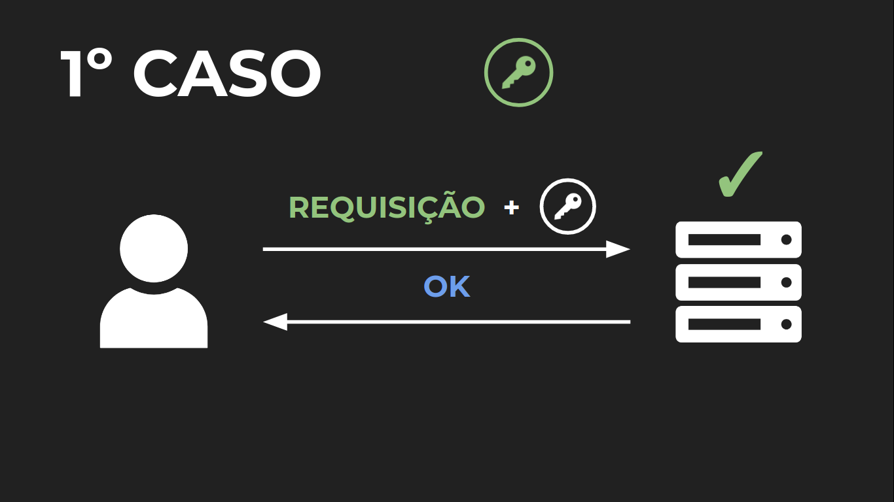
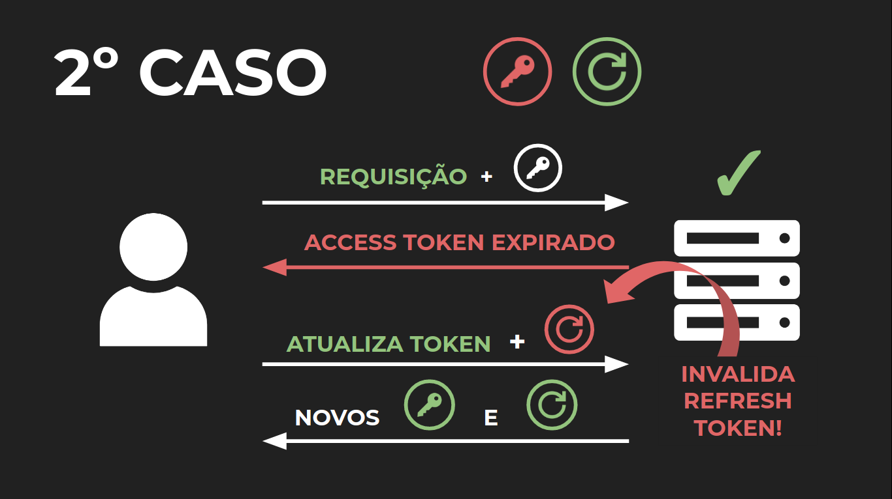
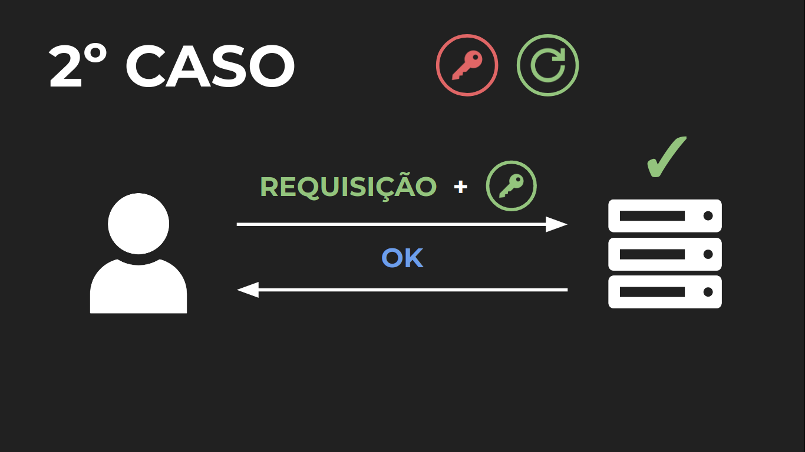
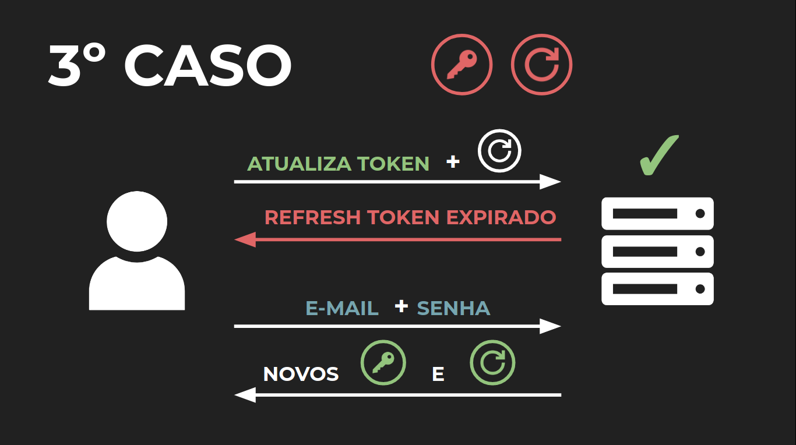

# Como renovar tokens

[00:00] No curso anterior, nós vimos como fazer um sistema de autenticação usando tokens. Dessa forma, sempre quando o usuário faz o login, põe e-mail e senha, ele vai receber um token chamado JWT para ele poder usar nas próximas requisições.

[00:16] Todo esse código está aberto no editor de texto e antes de nós começarmos a trabalhar em cima dele, eu queria comentar algumas modificações que ele teve em relação ao curso anterior, uma delas é que o pessoal front do Blog do Código disse que teve um pouco de dificuldade de se comunicar com a nossa “API”.

[00:37] Para resolver esse problema, nós decidimos padronizar a entrada saída da nossa aplicação para ser tudo em Json. Então, se nós formos em “app.js” do lado esquerdo, você vai ver que nós usamos o [ininteligível] bodyParser.json para permitir que o corpo das requisições seja em Json e não num formulário codificado em “URL”, que era como nós estávamos fazendo anteriormente.

[00:59] Outra coisa também que nós modificamos é que se nós formos em “usuarios-controlador.js” do lado esquerdo, você vai ver que a sintaxe das funções exportadas em module.exports mudou um pouco.

[01:14] Então, em vez de nós usarmos as arrow functions como nós estávamos fazendo anteriormente, agora nós usamos essa sintaxe para declarar métodos em objetos explícitos do Java Script, que fica muito mais parecido com funções nomeadas como essa [1787_Aula1.3_Imagem1] ou com métodos de classe do Java Script.

[01:34] E não só a sintaxe é diferente, a semântica muda um pouco e essa propriedade nós vamos explorar mais para frente baseado nessa nova sintaxe de declarar métodos que nós estamos usando.

[01:49] mais uma coisa que eu queria comentar, que foi modificado o jeito que nós escrevemos os [ininteligível], tanto do usuário, quanto dos posts, que nós usamos aquele método que fizemos no redis que é “promisficando” as funções de run, get e all que nós usamos para se comunicar com a base de dados.

[02:08] Desse forma nós conseguimos uma sintaxe bem mais enxuta para retornar promises e para se comunicar com o banco de dados da nossa aplicação.

[02:19] Teve uma coisa ou outra também modificada, mas tudo o que for importante, nós vamos comentar mais frente. Agora que você viu por cima as mudanças que tiveram no projeto do curso anterior para cá, eu queria chamar a tua atenção para uma característica do nosso sistema de autenticação com tokens.

[02:37] Nós já comentamos que pelo fato de nós estarmos usando um token JWT e por segurança, nós temos um tempo de expiração curto para os tokens, um tempo de expiração de 15 minutos.

[02:49] Só que dessa forma, sempre quando o token expira, o usuário tem que ir e realizar o login novamente para conseguir um novo token e conseguir continuar usando a nossa aplicação.

[03:00] Então a cada quinze minutos, ele tem que ficar fazendo login para continuar usando a nossa aplicação e isso não é muito confortável para o usuário, mas então como que nós conseguimos ter um sistema de autenticação com tokens e não precisar ter que fazer o login a todo o momento?

[03:19] Para resolver esse problema, nós vamos precisar inserir um novo elemento no nosso sistema, esse elemento vai ser um segundo token, um token capaz de gerar novos tokens à medida que eles vão expirando.

[03:32] Quando o usuário fizer o login com e-mail e senha, ele vai receber o token JWT, que ele já recebia anteriormente, mas também um segundo token, esse token que vai ter agora um tempo de expiração maior, em relação ao JWT e ele vai ser responsável por atualizar o token JWT, conforme ele expirar.

[03:55] Por causa dessas duas funções, nós vamos dar agora novos nomes para eles, o token JWT que nós já usávamos anteriormente é chamado de Access Token porque ele vai ser responsável pelo acesso às rotas protegidas.

[04:11] E o segundo token, o novo token que nós estamos adicionando agora vai chamar de Refresh Token ou Token de Atualização e Revigoração porque ele vai ser responsável por atualizar os tokens conforme eles expiram.

[04:24] Esse tipo de nomenclatura e dinâmica é muito popular em sistemas de autorização o [ininteligível]. Então vamos ver como que nós conseguimos implementar agora esse sistema usando o Refresh Tokens e melhorando a usabilidade da nossa aplicação.

# Explorando o uso de tokens

Neste curso, estamos criando um sistema de login com tokens para o Blog do Código. Dessa forma, algumas decisões de projeto levam em conta as demandas desse serviço. Entretanto, aplicações diferentes podem precisar de decisões de projeto diferentes. Assim, vamos descrever algumas modificações no projeto que podem extrair o máximo da escalabilidade dos tokens.

Remover rota de logout
Num contexto de sessões, é esperado existir uma operação de logout em conjunto com a de login. Entretanto, ao utilizar Json Web Tokens, é necessário criar uma blocklist para permitir essa operação e fazer consultas nessa base a cada uso do token.

Por isso, num sistema com muitos acessos, essa consulta pode sobrecarregar o servidor. Assim, pode ser interessante remover essa operação, eliminando a necessidade de consultar uma base a cada requisição, mesmo que seja em memória como o Redis.

Além disso, é possível remover essa rota e ainda simular uma operação de logout através da plataforma que consumiria a API. Por exemplo, um aplicativo mobile poderia guardar o token JWT no momento de login e, quando a pessoa executasse a operação de logout, esse token seria apagado da memória. Com isso, uma pessoa que possuísse esse token ainda poderia fazer requisições com ele mas quem estivesse usando o aplicativo da forma usual teria a ilusão de que o token foi invalidado. Ainda, o tempo de expiração do token deve ser diminuído para dificultar ataques.

Remover busca do usuário na base
No começo de toda rota que precisa de autenticação, a requisição passa por um middleware que verifica se a pessoa está autenticada e busca seu respectivo usuário na base, inserindo em req.user. Entretanto, se alguma dessas rotas tiver um fluxo de requisições muito alto e não há a necessidade de buscar as informações do usuário na base, apenas saber seu id, então pode ser interessante modificar esse padrão de desenvolvimento.

Assim, pode ser feito um outro middleware de autenticação que verifica o token e insere apenas o id na requisição. Dessa forma, essas rotas podem operar sem qualquer consulta numa base de dados.

Além disso, é possível notar o impacto de uma consulta a um banco através de alguns benchmarks. Se pegarmos um teste de requisições onde é feita uma consulta em banco, vemos que ela é 10 vezes mais lenta que uma requisição onde devolve-se apenas um plaintext .

https://www.techempower.com/benchmarks/#section=data-r19&hw=ph&test=db
https://www.techempower.com/benchmarks/#section=data-r19&hw=ph&test=plaintext

# Implementando refresh tokens

[00:00] Nós agora já sabemos que nós vamos precisar usar um segundo token para autenticação, mas como efetivamente ele vai ser usado? Para entender isso, vamos pensar numa situação que o usuário tem o access token expirado.

[00:15] O que ele vai querer fazer é acessar uma rota enviando ele para o servidor e o servidor vai devolver para o usuário falando que o access token está expirado, que ele vai precisar de um access token válido.

[00:27] É nesse momento que o refresh token entra em jogo, o usuário tendo refresh token válido, ele vai enviar isso para o servidor numa segunda rota, uma rota de atualização de token.

[00:39] O servidor vai ver, vai conferir se o refresh token está válido ou não, estando válido, vai devolver para o usuário dois novos tokens como na rota de login. Então o usuário vai conseguir ter um access token novo e realizar a requisição novamente.

[00:56] Por que eu também gero um novo refresh token, sendo que o anterior já era válido? Ainda estava dentro do tempo de expiração?

[01:05] Esse é um ponto muito importante, nesse esquema, os refresh token são de uso único, ou seja, sempre quando o usuário usa um refresh token para gerar dois novos tokens para atualizar o access token dele.

[01:18] O refresh token anterior, o que foi usado tem que ser invalidado, por isso que nós sempre temos que gerar um novo refresh token para substituir o antigo. Uma das vantagens dessa dinâmica é que ela permite a criação de um sistema de identificação de roubo de refresh tokens.

[01:34] Nós não vamos ver nesse curso, mas pode ser muito útil, dependendo da sua aplicação. Então é dessa forma que o refresh token vai funcionar dentro do nosso novo sistema de autenticação que nós vamos criar.

[01:49] É assim que o refresh token vai ser usado na nossa aplicação, mas como isso tudo é implementado? Como é a cara de um refresh token? A uma primeira vista, pode ser interessante implementar o refresh token como nós fizemos com o access token, como um token de JWT.

[02:07] Dessa forma, qualquer um vai conseguir ler o seu conteúdo e garantir a sua validade, sem ter que olhar no banco de dados. O problema é que um token JWT é valido durante todo o seu tempo de expiração.

[02:21] Então, se nós queremos invalidar ele antes disso, nós vamos ter que usar uma blacklist, só que o ‘’refresh token” é algo que no melhor dos casos vai estar sempre sendo invalidado dentro do seu tempo de expiração porque um access token tem um tempo de vida bem menor, em relação ao refresh token.

[02:41] E nós usamos um refresh token no momento que o access token expira e nós vamos gerar um novo refresh token e invalidar o antigo, ou seja, a cada 15 minutos, nós vamos estar gerando um novo par de tokens e invalidando o refresh token antigo, sempre que o access token expira.

[03:03] Como o refresh token pode ter um tempo de expiração bem grande na escala de dias, nós podemos ter potencialmente dezenas ou centenas de tokens por usuário, por dispositivo conectado e isso não é algo muito eficiente.

[03:20] Dessa forma, nós precisamos de uma nova solução e para resolver esse problema, nós podemos substituir a nossa blacklist que diz quais são os tokens inválidos por uma whitelist, que vai dizer quais são os tokens válidos, assim nós podemos consultar essa lista para saber quais são os tokens válidos dentro da nossa aplicação.

[03:42] Aliás, essa lista vai ser a única fonte de verdade sobre quais tokens são válidos e quais não são, mas então como nós já vamos ter que olhar a nossa lista de qualquer forma, nós não precisamos passar o payload a todo o momento pela rede e deixar ele na responsabilidade do usuário.

[04:04] Nós podemos pegar e também guardar o payload nessa lista usando o refresh token como chave, assim nós deixamos o payload apenas guardado dentro do nosso servidor.

[04:15] E como o payload vai estar seguro dentro do nosso servidor, nós não vamos precisar de uma assinatura para comprovar que os dados que o usuário tem em mãos são verdadeiros e nós não vamos precisar de cabeçalhos para ajudar nessa segurança.

[04:32] Então nós podemos substituir o refresh token que nós tínhamos construído como um Json do token para uma string aleatória, o bytes aleatório é difícil de [ininteligível] e que vai servir única e exclusivamente para ser a chave dessa lista, para nós podermos recuperar o payload e descobrir sobre qual usuário que essa aquisição está sendo feita.

[04:53] Então é dessa forma que nós vamos construir o nosso refresh token e nós conseguimos ver que o refresh token é bem diferente do access token, que está implementado como Json token porque um Json [ininteligível] qualquer pessoa pode pegar, decodificar ele [ininteligível] e ler o conteúdo dele que está em Json.

[05:17] Então qualquer pessoa pode pegar, ler o payload, entender o que está por dentro desse token, mas isso já não acontece com o refresh token porque ele apenas é uma senha aleatória, ele só faz sentido dentro do nosso servidor.

[05:32] E essa é a grande característica desse token e é por isso que ele é chamado de Token Opaco ou Opaque Token porque ele é um token que só faz sentido dentro do servidor e qualquer outro serviço, ele não vai ter nenhum significado.

[05:49] Então é por isso que na nossa aplicação, nós vamos ter dois tipos de tokens, token JWT e tokens opacos. Outra coisa que é importante nós falarmos são sobre dois termos que nós usamos nesse curso e no curso anterior, que é blacklist e whitelist.

[06:08] Esses dois termos são termos antigos e o mesmo que a sentença da sua verdadeira origem, elas ainda colaboram para a manutenção daquele símbolo de que a dicotomia preto e branco está relacionada com ruim e bom.

[06:21] E como programadoras e programadores exercem esse papel de grande impacto na sociedade é importante nós tentarmos quebrar esses costumes ruins e numa tentativa de quebrar esses costumes ruins, nós vamos substituir os termos blacklist e whitelist por blocklist que é lista de bloqueio no inglês e allowlist, que é lista de permissões.

[06:46] Dessa forma, além de ajudar a quebrar esse símbolo ruim, nós ainda vamos estar usando nomes potencialmente mais significativos, principalmente para quem não conhecia os termos anteriores.

[06:59] Dessa forma, vamos ver como que nós conseguimos implementar refresh token usando uma allowlist.

# Identificando roubos de refresh tokens

Nesse curso, não será detalhado um sistema que faz a identificação do roubo de refresh tokens. Mesmo assim, esse sistema, como já apresentado pelo SuperTokens (https://supertokens.io/blog/the-best-way-to-securely-manage-user-sessions), funcionaria da seguinte forma.

Para detectar o roubo, é necessário que tanto o atacante quanto a vítima usam o token após o ataque. Por exemplo:

Digamos que o refresh token refresh_token_0 da vítima foi roubado.

Em algum momento, o access token (access_token_0) da vítima expirará e, por isso, ambos terão que atualizar seus tokens.

Dessa forma, se o atacante usar refresh_token_0 antes, ele receberá novos tokens refresh_token_1 e access_token_1, invalidando o antigo.

Em seguida, quando a vítima tentar atualizar seus tokens, ela usará o refresh_token_0 invalidado. Isso dispara uma possível indicação de roubo, pois é esperado que a pessoa tivesse utilizado o refresh_token_1.

Numa outra situação, se a vítima usar refresh_token_0 antes, o argumento é análogo ao anterior.
Assim, se um roubo de refresh tokens for detectado, é possível disparar uma rotina que remove esse token da allowlist, cessando o ataque.

# Criando refresh tokens

[00:00] Com o projeto aberto no editor de texto, nós podemos começar a implementação da criação refresh token, para isso, vamos em "usuarios-controlador.js” do lado esquerdo da tela e vamos implementar a nossa função para a criação do refresh token.

[00:17] Parecido com o criaTokenJWT, vamos criar uma função: function criaTokenOpaco( ), vai ser nessa função que nós vamos gerar o token opaco. Vamos guardar ele em uma variável: const tokenOpaco =, como que nós geramos esse token opaco?

[00:41] Como nós já vimos, esse token opaco, o nosso refresh token, nada mais é que uma string ou bytes aleatórios [ininteligível] e para gerar bytes aleatórios, nós podemos fazer do mesmo jeito que fizemos para gerar a CHAVE_JWT para os access tokens, usando o método random bytes do módulo crypto.

[01:03] Então vamos importar o módulo crypto: const crypto, recebe o require(‘ crypto’ ), ficando:const crypto = require( ‘crypto’ ). Então nafunction criaTokenOpaco( ), o token vai receber o resultado de crypto.randomBytes( ) e transformando esses bytes aleatórios para uma string codificado em hexadecimal.

[01:34] E no método random bytes nós vamos definir a quantidade de bytes que nós queremos gerar, relativamente depende da sua aplicação, mas 24 bytes é uma quantidade razoavelmente grande para impedir até um ataque offline na tentativa de gerar, na tentativa de tentar chutar esse token opaco que nós estamos gerando.

[01:57] Então o token opaco vai ser uma string aleatória de 24 bytes e vamos retornar ela como resultado da função criaTokenOpaco. Para testar, nós podemos na função de login guardar esse token em uma variável, então vamos criar o refresh token e vamos guardar o retorno da função criaTokenOpaco( ).

[02:27] E uma parte interessante, como agora nós temos dois tokens, nós vamos precisar diferenciar esses dois, então no que antes nós usávamos apenas “token”, vamos chamar de “accessToken”, o nosso token JWT que nós usávamos antes, nós vamos agora denominar de “accessToken”.

[02:47] Então nós renomeamos tanto no momento que nós criamos o “accessToken”, quanto no momento que nós colocamos ele no set de autorização. Então, tendo o access token e tendo o refresh token, nós vamos devolver o refresh token como resposta da requisição, no corpo da resposta.

[03:05] Então com o Json, nós enviamos o refresh token, objeto do refresh token e como nós vamos devolver algo no corpo da resposta, nós não podemos mais usar o código 204, então nós usamos só o código 200 como resposta, código de status da resposta.

[03:23] Feito isso, vamos inicializar o nosso servidor. Inicializou tudo certo e vamos fazer uma requisição de teste para ver como que esse refresh token é retornado.

[03:41] Então abrindo a “Insomnia”, vamos ver se nós já temos um usuário na base, isso nós podemos fazer testando os usuários e no meu caso, eu não tenho ninguém.

[03:51] Então vamos criar um usuário com esse e-mail e senha, criei um usuário no botão “Send” no canto superior direito e agora eu vou fazer o login usando esse usuário que eu criei.

[04:01] Realizando o login, nós vemos que eu recebo um refresh token e o serial é apenas um string aleatória em hexadecimal e nós recebemos tanto o refresh token como o access token que está no header de autorização como nós implementamos no curso anterior.

[04:18] Com o token criado, nós precisamos verificar ainda duas coisas antes de colocar ele em uma allowlist. Voltando para o código, as duas coisas que nós precisamos certificar que nós vamos ter para poder colocar ele em uma allowlist, uma delas é o ID do usuário e outra, o tempo de expiração do token.

[04:39] O ID, nós conseguimos recuperar, nós conseguimos obter do mesmo jeito que nós fizemos com o access token, enviando o usuário para um método de criação do token.

[04:51] Então em criaTokenOpaco, nós vamos adicionar um argumento usuário, então vai ser nesse argumento que nós vamos conseguir recuperar o ID do usuário, que vai ser o conteúdo do payload do token: function criaTokenOpaco(usuario).

[05:07] E agora, o segundo elemento que nós precisamos é o tempo de expiração do token, para nos ajudar nesse processo, nós podemos usar um módulo do “NPM”, chamado “moment.js”.

[05:20] O “moment.js” é módulo “NPM” que trabalha com datas e horários e várias outras coisas relacionadas com o tempo e ele vai auxiliar na criação de uma forma bem mais fácil desse tempo de expiração que vai permitir que nós consigamos “setar” o tempo que nós queremos de uma forma bem amigável para o desenvolvedor.

[05:44] Então no nosso código vamos terminar o servidor e instalar esse pacote com: npm install moment@ a versão que nós vamos estar usando nesse curso que é “2.26.0”: npm install moment@2.26.0.

[06:05] Vamos esperar ele instalar. Terminado de instalar, nós podemos usar ele no nosso código importando: const moment vai receber o require(‘moment’) e nós vamos usar ele para gerar o tempo de expiração em criaTokenOpaco, guardando isso em uma variável.

[06:37] O resultado que nós vamos gerar em const dataExpiração que vai receber o resultado de moment, chamando a função moment que vai ser o momento atual, adicionado o tempo que nós queremos e transformando isso para unixtimestamp.

[07:06] E qual vai ser o tempo de expiração que nós vamos colocar nesse token? Isso varia de implementação para implementação, dependendo do nível de segurança que você pode precisar.

[07:18] Às vezes um tempo de expiração de horas ou até minutos pode ser necessário, mas para o nosso caso, um tempo de expiração de cinco dias já é o suficiente.

[07:28] Então no argumento add, nós vamos colocar cinco e a unidade de tempo que nós vamos estar usando “d” de dias: const dataExpiracao = moment() .add (5, ‘d’ ). Unix( ).

[07:37] Então nós vamos ter uma data de expiração do momento atual mais cinco dias, convertido para um unix timestamp. Então essa vai ser a data do momento que o token vai expirar.

[07:48] Então tendo acesso ao ID do usuário e a data de expiração, nós podemos começar a implementar uma allowlist.

# novo fluxo de autenticação
PRÓXIMA ATIVIDADE

Nesse novo sistema de autenticação com access tokens e refresh tokens, a fluxo de uso da pessoa que estará utilizando a aplicação muda um pouco. Por isso, é interessante detalhar o processo para entender como tudo isso funciona.

Esse fluxo pode ser dividido em três casos:

1º caso: access token válido
Neste caso, a pessoa quer fazer uma requisição para alguma rota que precisa de autenticação, como cria posts. Então, ela envia o seu access token na requisição e, como ele é válido, o servidor devolve OK, criando o post.

2º caso: access token inválido e refresh token válido
Após fazer login, em algum momento, o access token que a pessoa está usando vai expirar. Neste momento, quando ela realizar uma requisição como cria posts, o servidor vai responder dizendo que o access token está expirado.

Assim, a pessoa terá que atualizar os tokens através da rota atualiza token, enviando o refresh token. Como este último está válido, o servidor devolverá dois novos tokens como na requisição de login. Além disso, o refresh token antigo deverá ser invalidado.

Com os dois novos tokens válidos, a pessoa pode continuar utilizando a aplicação como no caso 1.

A grande vantagem dessa rota é que ela pode ser feita “por baixo dos panos” através de uma aplicação front-end que a pessoa pode estar utilizando. Assim, ela guardaria os dois tokens de autenticação e faria automaticamente uma requisição para atualizá-los sempre que o access token expirasse.

3º caso: access token e refresh token inválidos
Neste caso, como seu access token está expirado, ela tenta atualizar seus tokens numa rota atualiza tokens. Porém, seu refresh token também está expirado. Assim, para conseguir um novo access token, ela terá que realizar o login novamente.

Mesmo assim, como o refresh token tem um período de expiração bem maior, essa situação só vai acontecer após um período de 5 dias (tempo utilizado no curso) de inatividade da pessoa.

# Manipulando uma lista genérica

[00:00] Agora nós podemos começar um processo de construir a allowlist para os refresh token. A allowlist vai ser muito semelhante à blocklist que nós já tínhamos feito no curso anterior.

[00:11] Como nós vamos fazer uma manipulação com o client redis, nós vamos ter que criar essa interface que vai disponibilizar funções para que o nosso programa consiga se comunicar com o client redis sem ter que efetivamente usar as funções do redis de comunicação com o banco.

[00:31] Como potencialmente nós podemos querer ter várias outras listas, esse código pode acabar se tornando repetitivo, nós sempre tendo que fazer essas interfaces de comunicação com o banco.

[00:45] Então para padronizar e evitar uma repetição de código desnecessária, nós podemos querer fazer esse mesmo processo, só que para uma lista genérica, fornecendo todas as funções que nós vamos precisar e dessa forma, só modificando o essencial.

[01:04] Assim, na pasta “redis” do lado esquerdo, vamos criar um novo arquivo chamado: “maniputa-lista.js”, semelhante ao “manipula-blocklist.js”, só que para uma lista genérica.

[01:16] E o [ininteligível] desse módulo vai ser: module.exports, esse módulo vai ser uma função que vai receber uma função que vai receber uma lista, o client redis que nós vamos fornecer e vai devolver as funções de manipulação dessa lista, mas que funções nós vamos ter que devolver?

[01:37] Nós podemos começar com as operações que nós fazemos em “manipula-blocklist.js”, se nós dermos uma olhada de novo, nós vemos que nós realizamos duas operações, uma que adiciona um par chave valor dentro da lista com um termo de expiração e outro que verifica se um determinado token e se uma determinada chave está dentro da nossa lista.

[02:06] Então [ininteligível] a criação dessas duas funções, então no module.exports nós criamos a função async adiciona( ), que vai receber uma chave, um valor e uma data de expiração: async adiciona(chave, valor, dataExpiracao) .

[02:26] E uma segunda função, a função: async contemChave, que vai receber uma chave e devolver true ou false, baseando-se se a chave está dentro da lista ou não.

[02:37] Para implementar isso, nós podemos fazer um método muito semelhante ao que nós fizemos em “manipula-blocklist.js”. Primeiro, nós vamos “promisificar” as funções do client redis, para isso vamos importar a função promisify que vai receber require de util: const { promisify } = requite(‘util’).

[03:04] E abaixo nós vamos “promisificar” as duas funções do client redis que nós usamos. Uma delas nós vemos no “manipula-blocklist.js” é o método set, então vamos criar: const setAsync que vai receber o promisify do método set da lista, fazendo um bind com a lista: const setAsync = promisify(lista.set) .bind(lista).

[03:33] E da mesma forma, nós criamos existsAsync que vai receber o promisify do método exists da lista, fazendo um bind dessa lista: const existsAsync = promisify(lista.exists) .bind(lista).

[03:51] Então embaixo, nós podemos fazer a implementação do mesmo jeito que nós tínhamos feito antes. Nós fazemos o await setAsync( ), onde nós vamos inserir a chave e o valor dentro da lista: await setAsync(chave, valor).

[04:07] E nós usamos o método da lista expireat para inserir o tempo de expiração na chave e inserindo um tempo de expiração da data de expiração através da chave: lista.expireat(chave, dataExpiracao).

[04:24] Embaixo, nós fazemos da mesma forma que nós tínhamos feito em “manipula-blocklist.js”, nós guardamos em um resultado, o retorno da função, retorno de await existsAsync enviando a chave: const resultado = await existsAsync(chave). Então, nós verificamos se a chave existe.

[04:45] E retorna se esse resultado é equivalente a 1 porque o retorno de “existsAsync” é só 01: return resultado ===1. Então nós implementamos essas funções, mas é o suficiente?

[05:00] Se você pensar, nós ainda precisamos de mais outras operações que nós vamos ter que realizar, principalmente agora com allowlist.

[05:08] Uma das operações que nós vamos querer é recuperar o valor da lista recebendo a chave, ou seja, quando o usuário enviar o refresh token para nós, nós vamos querer recuperar o upload que está dentro da lista.

[05:23] Então isso vai motivar a criação dessa função buscaValor, onde nós vamos enviar uma chave: async buscaValor(chave) e vai retornar o valor que está dentro da lista, do nosso par, chave, valor, pode ser implementado usando o método get [ininteligível].

[05:46] Para isso nós vamos “promisificar” esse método com const getAsync que vai receber promisify do método get de lista fazendo um bind com a lista: const getAsync = promisify(lista.get).bind(lista).

[06:03] Então o buscaValor vai ser basicamente um retorno de getAsync enviando a chave: return getAsync(chave) e o segundo método que nós vamos ter que implementar vai ser a parte que nós invalidamos o refresh token.

[06:20] Ou seja, no momento que o usuário envia o refresh token para nós, nós buscamos o valor e nós vamos querer em seguida deletar ele da base, nós vamos querer remover o par chave, valor que está na nossa lista.

[06:34] Então embaixo nós criamos a função deleta, que vai receber a chave e vai realizar a operação de deletar o par chave, valor dentro da lista: async deleta(chave)e isso pode ser implementado usando método del do redis.

[06:55] Então em cima, nós “promisificamos” o método del, criando o delAsync, que vai receber promisify, o método del da lista, usando o bind com a lista: const delAsync = promisify(lista.del).bind(lista).

[07:10] E logo embaixo nós executamos: await delAsync, enviando a chave: await delAsync(chave), agora são essas as operações que nós vamos precisar para realizar a implementação de uma allowlist.

# Armazenando refresh tokens

[00:00] Com a allowlist pronta, você pode estar se perguntando: “Já que nós temos essa interface, a “manipula-lista.js” que faz manipulação genérica de uma lista, n´s não podemos usar ela para refatorar ou manipular o blocklist que nós implementamos no curso anterior?”.

[00:18] Nós conseguimos, já que as duas últimas linhas, tanto de adiciona, quanto de contemToken são basicamente as mesmas que nós implementamos em “manipula-lista.js”. Dessa forma, vamos refatorar o “manipula-blocklist.js”, começando com a importação do “manipula-lista.js”.

[00:38] Então const manipulaLista vai receber o require, então módulo manipula-lista desse diretório: const manipulaLista = require( ‘.manipula-lista’).

[00:46] Com o manipulaLista nós podemos criar o manipula-blocklist, então: const manipulaBlockList vai receber manipulaLista aplicado à blocklist: `const manipulaBlockList = manipulaLista(blocklist), que é o client redis que nós importamos na primeira linha.

[01:05] E com o manipulaBlocklist, nós temos as funções para a manipulação do client redis, dessa forma nós conseguimos substituir essa manipulação explicitada no método adiciona por await manipulaBlocklist.adiciona( ), onde nós enviamos a chave, que é o tokenHash, o valor que é uma string vazia e a data de expiração, que é a variável dataExpiracao.

[01:35] Na mesma forma na função de baixo, nós invés de calcularmos o resultado e retornar o resultado explicitamente, nós apenas retornamos: return manipulaBlocklist.contemChave( ), onde a chave é otokenHash`.

[01:56] Assim nós não estamos fazendo nenhuma manipulação explicita do client redis, com isso nós conseguimos remover o setAsync, existsAsync e o promisify.

[02:07] Então toda essa lógica, toda essa dependência fica só no manipulaLista de mexer explicitamente com o * client redis* e de mexer com as funções do client redis.

[02:21] E como nós temos agora uma dependência bem menor nesse arquivo, nada mais justo do que trazer o conteúdo do “blocklist.js” para o “manipula-blocklist.js”.

[02:32] Então como nós já fizemos em “blocklist.js”, nós vamos importar o redis, então: const redis vai receber o require de redis: const redis = require(‘redis’) e invés de importar ablocklist, nós vamos e criamos o *client redis*,redis.createClient( )com o prefixoblocklist:const blocklist = redis.creatClient({prefix> ‘blocklist:’ }).

[03:02] E tendo feito isso, nós conseguimos motivar a criação de um prefixo mais explicito para o que nós estamos fazendo, como nós podemos querer usar mais de uma blocklist no nosso sistema, nós colocamos sobre o que nós vamos estar tratando nessa blocklist, que no caso vai ser sobre access token.

[03:22] Então o prefixo, invés de apenas blocklist “Dois pontos”, vamos usar: blocklist-access-token “Dois pontos” e como toda a lógica da blocklist, do access token está nesse arquivo, nós podemos remover o “blocklist.js” da pasta “rides” e renomear o “manipula-blocklist.js”.

[03:50] Então do mesmo jeito que nós nomeamos “allowlist”, nós renomeamos “manipula-blocklist.js” para “blocklist-access-token.js”. E dessa forma, nós vamos ter que também mexer nas dependências que nós tínhamos anteriormente.

[04:11] Então uma delas é o nosso “server.js”, no momento que nós fazíamos a inicialização da blocklist, nós agora vamos ter a blocklist-access-token e nós também vamos ter que renomear nos lugares que nós usávamos a blocklist, que era “usuarios-controlado.js”, logo em cima.

[04:34] Então, invés de manipula-blocklist, nós vamos estar apensas usando blocklist-access-token e nós também usamos isso na “estategias-autenticacao.js”. Nós vamos renomear onde nós usamos a manipula-blocklist para blocklist-access-token.

[05:03] Feito isso, vamos fazer só umas requisições para ter certeza que a blocklist se comporta como antes. Primeiro vamos só se certificar que o nosso servidor está rodando com o npm start e agora vamos para o “Insomnia”.

[05:15] Primeiro realizar uma requisição de login para nós conseguirmos um access token, pegando ele do header de autorização, nós usamos ele no logout para primeiro: invalidar ele.

[05:29] Vamos fazer a segunda requisição com o mesmo token e deu o que nós esperávamos, o token foi invalidado por logout, então significa que ele está na blocklist invalidado, como nós já estávamos esperando.

[05:41] Dessa forma, é assim que nós conseguimos refatorar a blocklist para conseguir prosseguir para os próximos passos.

# Verificando refresh tokens

[00:00] Agora que nós temos o “middlewares” de autenticação refresh implementado, nós podemos finalizar essa saga da construção de um sistema de autenticação com refresh tokens, só implementando as rotas que faltam, só rotas de atualização de tokens e de [ininteligível].

[00:18] Então vamos em “usuarios-rotas.js”, implementar a primeira rota, a de autorização de tokens. Então vamos escrever: app.route e no caso vamos escrever o endereço dessa rota que vai ser usuário/atualiza_token: `app.route( ‘/usuário/atualiza_token’).

[00:38] Então esse vai ser o endereço da rota de atualização de tokens e essa questão deve ser feita com o método .post( ) porque o usuário vai enviar no corpo da requisição o refresh token.

[00:54] Dentro do método post, nós vamos inserir o middlewaresAutenticacao. refresh para conseguir validar o refresh token que o usuário vai estar enviando para nós. Em seguida, nós podemos chamar o método para atualização dos tokens.

[01:12] O primeiro instinto para nós é ter que criar um novo método para fazer essa atualização dos tokens, do mesmo jeito que nós fazemos com o login, com o logout em adiciona, criar um novo método no controlador para realizar a ação que nós queremos.

[01:27] Nós vemos essa situação com mais calma, nós vemos que tudo relacionado ao refresh token que o usuário envia para nós, já é tratado no “middlewares” de autenticação, lá mesmo ele vê se o refresh token é válido, já invalida ele passa para frente a requisição.

[01:47] E o que falta, a única coisa, o único processo que falta para essa rota é gerar dois novos tokens, um access token e um refresh token e isso é exatamente a função desse método, o método login do controlador.

[02:03] Então, invés de ter que gerar um novo método no controlador, nós podemos só reutilizar o que nós já temos, que no caso: usuariosControlador.login, que ele vai literalmente gerar os dois tokens que nós precisamos e é dessa forma que nós conseguimos criar, nós conseguimos implementar a rota de atualização de tokens.

[02:22] E você pode estar pensando que isso foi só uma coincidência, mas na verdade foi uma questão de projeto e essa foi a motivação para nós invalidarmos o refresh token antes da criação dos tokens, não depois porque nós conseguimos encapsular tudo no “middlewares” de autenticação e em seguida, deixar todo o trabalho para o login e nós conseguirmos reutilizar esse método.

[02:44] Então vamos testar para ver como que está se comportando essa funcionalidade que nós já fizemos. Vamos certificar que está funcionando o serviço e vamos para a “Insomnia” e criar essa nova requisição.

[02:58] Então uma nova requisição no botão “Mais” do lado esquerdo no menu, chamada “Atualiza token”, vai ser uma requisição com o método “post” com corpo em Json.

[03:08] O endereço da requisição vai ser “localhost:3000” para “usuario/atualiza_token”, para realizar [ininteligível] nós vamos precisar de um refresh token, então vamos primeiro fazer um login. Conseguimos um refresh token novo, vamos copiar e enviar no corpo da requisição no botão “Send” canto superior.

[03:30] Vamos executar e deu certo, nós recebemos o código “200 OK”, um refresh token novo e um access token novo e para nós vermos é exatamente o mesmo formato de uma resposta que nós receberíamos no login porque é o mesmo controlador que nós estamos chamando.

[03:46] Vamos tentar fazer essa aquisição de novo e ver o que acontece. Em tese, esse refresh token antigo deveria ter sido invalido no “middlewares” de autenticação. Vamos executar de novo e realmente, o refresh token está invalido porque ele foi invalidado no “middlewares”.

[04:01] E o que acontece se nós fizermos uma requisição com o corpo vazio? Nós recebemos um novo tipo de erro, dizendo que o refresh token não foi enviado, que são as duas verificações que nós fazemos no “middlewares” de autenticação.

[04:17] Então, aparentemente ele está se comportando do jeito que nós esperamos. É assim que nós implementamos essa rota. Agora vamos tentar fazer a rota de login. É assim que nós implementamos a rota de atualização e agora vamos fazer a rota de logout.

[04:34] Nós conseguimos ver que nós já temos uma rota de logout para o access token e pode ser interessante nós usarmos a mesma rota para fazer o logout, tanto do access token, quanto do refresh token.

[04:45] Então, dessa forma, vamos modificar essa rota para fazer com que o usuário tenha que enviar para nós tanto o access token, quanto o refresh token. Dessa forma, invés de um método get, nós vamos querer um método post, que o usuário vai enviar no corpo da requisição o refresh token.

[05:09] Então ele vai ter que agora enviar esses dois tokens, nós modificamos essa rota e como ele vai enviar o refresh token para nós, nós também vamos precisar ter esse novo “middlewares” de autenticação que nós criamos, nós vamos ter que usar o “middlewares” refresh nessa rota do post.

[05:25] Como que nós conseguimos fazer isso? Já no .route( ‘/usuario/logout’) nós usamos o middlewaresAudenticacao.bearer. Nós podemos só, invés de enviar o “middlewares” de autenticação nesse argumento, nós conseguimos enviar uma lista “middlewares”.

[05:40] Então para fazer isso, nós podemos substituir o “middlewares” de Autenticacao.bearer por uma lista, onde tem esse “middlewares”, mais o “middlewares” de Autenticacao.refresh, que nós podemos copiar.

[05:54] Pronto: .post ([middlewaredAutenticacao.refresh, middlewaresAutenti-cacao.bearer], usuariosControlador.logout, nós conseguimos usar os dois de uma vez, então a requisição vai primeiro passar por um e depois, em seguida, vai para o segundo “middlewares” para depois chamar o método do controlador.

[06:10] Agora nós vamos estar usando esses dois “middlewares” e o que nós vamos precisar alterar do método do controlador no “logout” para conseguir fazer com que o logout realmente funcione? Nós conseguirmos validar os dois token.

[06:24] Nós não precisamos alterar mais nada, só colocar esse middlewaresAutenticacao.refresh já está tudo certo, mas como só esse “middlewares” consegue realizar esse tipo de coisa?

[06:36] Como nós já implementamos o próprio middlewaresAutenticacao já faz já consegue invalidar o refresh token, dessa forma, quando ele for passar para os outros “middlewares” e chegar no método controlador do logout, nós já vamos ter um refresh token validado e o método controlador só vai ter que validar o access token.

[06:58] Então só esse “middlewares” já consegue finalizar a implementação da rota de logout. Vamos então no “Insomnia” para ver se ele está fazendo o que nós esperamos.

[07:11] Primeiro, vamos fazer um login para conseguir dois tokens novos e vamos copiar primeiro o “refreshToken” e colar ele no corpo da requisição e o access token, vamos colar nos headers de autorização. Vou fazer a requisição no botão “Send” no canto superior direito e não deu certo.

[07:34] Por que não deu certo? Nós também temos que mudar o método, vamos usar agora o método post, que antes nós estávamos usando o get. Deu certo, código 204. Vamos tentar agora usar separadamente esses tokens.

[07:46] Primeiro vamos usar o refresh token numa requisição de atualização de tokens e deu errado, o refresh token inválido não. É, deu certo refresh token está inválido, que é o que nós estamos esperando.

[07:58] Em seguida, vamos tentar usar o access token que nós tínhamos para uma rota de criação de posts. Vamos então colar o nosso access token no Token, executar no botão “Send” no canto superior direito e o refresh token foi invalidado por logout.

[08:13] Dessa forma nós conseguimos ver que essa rota de logout que nós temos, que efetuou o logout, consegue invalidar os dois tokens de uma vez, como nós estamos esperando. Então é assim que nós conseguimos implementar um sistema de autenticação com access token e refresh token.

# Implementando as rotas

[00:00] Agora, só para finalizar, vamos fazer uma pequena simulação para entender como que todas essas coisas que nós implementamos até agora vão funcionar juntas, como que vai ser o fluxo de um usuário na nossa aplicação.

[00:13] Para fazer essa simulação, nós vamos ter que ir em “usuarios-controlador.js” e modificar um pouco do tempo de expiração do access token, então invés de um tempo de expiração de 15 minutos, vamos fazer um tempo de expiração de 20 segundos.

[00:25] É o suficiente para nós conseguirmos simular o comportamento do access token. Então vamos certificar que está funcionando o servidor, está tudo certo. Vamos no “Insomnia” e realizar uma requisição.

[00:38] O usuário vai entrar na nossa aplicação e vai fazer o login, então o login com e-mail e senha, vai receber um refresh token e um access token. Então, ele vai pegar, copiar o access token e usar nas requisições.

[00:51] Por exemplo, ele vai criar um post, então ele coloca no Json e começa a criar um post, cria um, cria dois e esses posts que tem na nossa aplicação, vai tentar criar um terceiro post e já não deu certo, o token expirou.

[01:07] Como o token expirou, o que ele vai querer fazer é atualizar o token usando o refresh token dele, então ele vai em “efetua login” do lado esquerdo. Primeiro ele precisa copiar o refresh token que ele conseguiu no login e usar na requisição de atualização de tokens.

[01:22] Realizando a requisição, ele recebe um novo refresh token e access token. Então com essa access token nova, ele pode usar nas próximas [ininteligível] que ele fizer e pronto.

[01:34] Ele não precisa ter que inserir o login e senha novamente e toda essa operação de guardar o refresh token e de fazer uma nova requisição com esse refresh token para atualizar os dois tokens, pode ser feito pelo front change.

[01:49] Então no fundo o usuário nem vai sentir todas essas requisições que vão estar sendo feitas por baixo dos panos. Dessa forma, você consegue criar toda essa aplicação usando tokens e ter a mesma sensação de que você está num sistema com sessões.

[02:08] Dessa forma, é assim que funciona uma aplicação, um sistema de autenticação usando access token e refresh token.

# OAuth 2.0 e OpenID Connect

Como já foi comentado anteriormente, o uso de access tokens e refresh tokens em estratégias de autenticação/autorização não é algo inédito. Dois protocolos de autorização e autenticação se popularizaram nos últimos anos que utilizam tokens para representar os certificados de uma pessoa para clientes terceiros: OAuth 2.0 (https://auth0.com/docs/protocols/oauth2) e OpenID Connect (https://auth0.com/docs/protocols/oidc).

O artigo e vídeo da Okta (em inglês - https://developer.okta.com/blog/2019/10/21/illustrated-guide-to-oauth-and-oidc) explica muito bem as motivações e funcionamento desses dois protocolos. Além disso, existem diversas bibliotecas (https://oauth.net/code/nodejs/) para Node.js que implementam isso.

# Modularizando a criação

[00:00] Com os métodos de criação de tokens implementados, nós podemos agora enviar tokens para os usuários e esses usuários vão querer em uma próxima requisição enviar esses tokens de volta para nós.

[00:12] E isso motiva a criação do nosso segundo método, que é o método verifica, que vai verificar esses tokens, esses tokens que nós vamos receber do usuário. O que esse método verifica vai fazer é receber esses tokens e devolver o payload deles, que no nosso caso é o “id” do usuário.

[00:33] E isso nós vamos ter tanto em access, quanto em refresh, o método verifica, mas como que nós conseguimos implementar esses dois métodos? Nós podemos usar a mesma técnica que nós fizemos em cria, onde nós temos um criaTokenJWT, essa função.

[00:52] Então ele verifica que nós vamos devolver o valor de verificaTokenJWT, que vai receber o token do argumento e em refresh, nós vamos retornar o valor de verificaTokenOpaco, recebendo o token.

[01:15] Nós vamos ter essas duas funções, então primeiro vamos focar em verificaTokenJWT, eu quero implementar essa função e isso nós conseguimos fazer logo abaixo de criaTokenJWT: function verificaTokenJWT(token), como que nós conseguimos implementar essa função?

[01:34] Nós podemos olhar em “estratégias-autenticacao.js”, logo no final, na estratégia bearer, nós implementamos toda essa funcionalidade, onde nós temos verificaToken na blocklist e a chamada de jwt.verify, que faz todas as verificações de um token JWT e as verificações de ele estar na blocklist ou não, se o token tiver um blocklist.

[02:00] Por isso nós conseguimos recortar essas duas linhas [1787_Aula3.3_Imagem1] e colar em verificaTokenJWT, como nós chamamos verificaToken na blocklist, nós também precisamos trazer a definição dessa função [1787_Aula3.3_Imagem2], então nós recortamos ela, cola em “tokens.js”, logo abaixo de verificaTokenJWT.

[02:22] E também nós temos a blocklist, uma dependência dessa função e nós podemos recortar a importação dela e colar logo abaixo de allowlistRefreshToken e com isso nós conseguimos aproveitar e renomear a blocklist para usar o mesmo jeito que nós fizemos com a allowlist.

[02:42] Então fazer blocklistAccessToken, especificando sobre que token que nós estamos tratando nessa blocklist. Nós copiamos e colamos um monte de coisas, nós recortamos colamos várias coisas, mas vamos rever o que nós temos aqui.

[02:59] Então nós vamos receber um token, vai verificar se ele está na blocklist ou não e vai devolver o payload, nós vamos receber o payload a partir do jvt.verify. E o que nós queremos fazer em verificaTokenJWT é devolver o id que vai estar no payload.

[03:16] Então para recuperar essa id, nós podemos usar a desestruturação de objeto, então invés de guardar uma variável payload, nós já recuperamos de uma vez o id e nós retornamos isso como resultado dessa função e como nós estamos usando await, nós vamos colocar async na definição da função.

[03:38] Só que essas funções ainda têm o mesmo problema que nós encontramos com a função cria porque o que nós estamos usando é a blocklist access token, não a blocklist genérica.

[03:50] Dessa forma, o que nós vamos querer é passar a blocklist como argumento dessa função, então o que nós vamos querer é uma blocklist genérica, onde a blocklist vai ser passada como argumento.

[04:06] Então já substitui a que nós estávamos usando antes e passamos todas as blocklists como argumento e é dessa forma que nós conseguimos implementar o verificaTokenJWT e nós podemos pegar e inserir apenas a blocklist que falta, que nós ainda não definimos no access token.

[04:28] Então nós vamos definir a lista dele, que vai ser a blocklistAccessToken e nós enviamos como argumento com o this.lista. Dessa forma, o verificaTokenJWT já está certo e agora nós podemos voltar para o verificaTokenOpaco, que é uma função.

[04:49] Essa implementação já está feita, só que em “middlewares-autenticacao.js”, que é essa função verificaRefreshToken, nós podemos recortar a função [1787_Aula3.3_Imagem3] e colar logo abaixo de criaTokenOpaco, só que renomeando para invés verificaRefreshToken, vai ser verificaTokenOpaco.

[05:12] E invés de receber o refreshToken como argumento, nós vamos receber só o token. Então vamos verificar se ela faz tudo o que nós estamos querendo. Nós verificamos se o token foi enviado ou não. Nós recuperamos ele, nós recuperamos o id que está no allowlist, verifica se o refreshToken está inválido e devolve o id.

[05:37] Nessa passada, nós já vimos que temos o mesmo problema de sempre, nós estamos explicitando a allowlistRefreshToken. Então o que nós vamos querer é apenas uma allowlist genérica que vai ser passada como argumento na chamada dessa função.

[05:52] Só que tem outra coisa que nós não tínhamos visto anteriormente, que a mensagem de erro, nos dois erros que nós enviamos, está explicitando o tipo de token que nós estamos usando.

[06:06] Nesse caso é o refresh token e o que nós queremos é que as mensagens de erro sejam diferentes para tipos de tokens diferentes e como que nós conseguimos fazer isso? Nós fazemos isso parametrizando também o nome do token.

[06:21] Então, além de ter token e allowlist, nós vamos ter também o parâmetro nome. Dessa forma, nós podemos substituir as strings por uma template string, invés de Refresh, que era para ser refreshToken, nós substituímos pornomee invés deRefresh token inválido, invés deRefresh token, nós colocamosnome`.

[06:45] Então vamos ter “alguma coisa” token não enviado e alguma coisa token inválido. Dessa forma, a mensagem de erro que nós vamos enviar vai depender do nome do token que nós definirmos.

[07:01] Com isso, logo em verifica do refresh, nós vamos enviar allowlist na lista, mas também vamos querer enviar o nome. Então vamos definir o nome desse token que vai ser refresh token.

[07:18] Assim nós enviamos tanto o this.nome e this.lista, assim nós conseguimos implementar tanto o verificaTokenOpaco, como verificaTokenJWT e aliás, nós ainda podemos refatorar um pouco dessa verificação [1787_Aula3.3_Imagem4] em duas funções diferentes.

[07:47] Para isso nós podemos até usar uma feature do VS Code, que é para extrair isso para uma função global e nós criamos essa nova função chamada: verificaTokenEnviado e embaixo, nós vamos também extrair essa função para verificaTokenValido.

[08:19] Essa propriedade do VS Code, ele já extrair para essas duas funções: verificaTokenValido e verificaTokenEnviado, que eu vou até trazer mais para perto da definição da função verificaTokenOpaco.

[08:32] Assim nós conseguimos reutilizar essas duas funções mais para frente, caso nós queiramos verificar se o token foi enviado ou não e para um ou outro tipo de token que não seja o token opaco.

[08:44] E outra coisa que nós não tínhamos reparado anteriormente, pois nós não explicitávamos o tipo do token, mas a mensagem de erro de verificaTokenBlocklist apenas diz: Token inválido por logout e nós podemos querer também dizer: “Access token inválido por logout”.

[08:59] Assim nós substituímos a string por uma template string, nós substituímos token pelo nome do token que nós vamos querer. Então nós enviamos o nome e também verificaTokenJWT, nós colocamos tanto na definição da função, na chamada da função verificaTokenBlocklist.

[09:21] Então essas três partes nós colocamos o “nome” e nós definimos em access o nome dele que vai se chamar: access token e nós enviamos isso em verificaTokenJWT, this.nome e é dessa forma que nós conseguimos fazer a função de verificação.

[09:49] E agora nós podemos ir e substituir o método antigo de verificação nos tokens por esse novo modelo. Então primeiro vamos fazer do access token, estava implementado em “estratégias-autenticacao.js”, nós vamos precisar primeiro importar o módulo tokens.

[10:06] Então const tokens vai receber o require(‘./tokens’) e embaixo na estratégia bearer, nós vamos fazer a verificação do token, essa verificação vai retornar um id, então: const id vai receber await tokens.access.verifica(token), onde nós enviamos o token.

[10:31] E dessa forma, agora que nós temos o token, nós temos o id, nós não precisamos mais de payload.id e sim apenas id. Além de criar também essa abstração, onde nós explicitamente estamos fazendo a verificação de um access token, em cima nós não vamos precisar mais do módulo, dessa dependência que é o JWT na estratégia de autenticação.

[10:54] Está tudo organizado e concentrado em “token.js”. Feito isso, nós podemos também substituir refreshToken em “middlewares-autenticacao.js”, primeiro nós importamos o módulo dos tokens, então: const tokens = require (‘.tokens’) tokens está nesse diretório.

[11:15] E embaixo no middlewares refresh, nós substituímos verificaRefreshToken por tokens.refresh.verifica e está tudo certo, nós vamos fazer alguns testes para ver se está tudo rodando como o esperado. [11:35] Vamos certificar que o servidor está doando vamos primeiro fazer uma requisição de login no “Insomnia”, nós conseguimos um refresh token e um access token e vamos tentar fazer uma [ininteligível] de logout. Fazendo o logaut do refresh token, copiando ele e copiando o access token.

[11:57] Copiando esses dois tokens, nós vemos que está tudo certo, mas realizando de novo, nós vemos que tem um erro: “InvalidArgumentError is not defined”. Isso acontece porque nós realmente esquecemos de trazer InvalidArgumentError para “tokens.js”.

[12:13] Então, precisa nós copiarmos ele, por exemplo, nós conseguimos definir esse módulo de erros customizados que nós temos. Dessa forma, nós conseguimos executar o código novamente. Realizando o login, onde nós conseguimos um refresh token novo e um access token novo para o logout.

[12:40] Executando a mesma ação dá certo e executando de novo nós recebemos um “401” dizendo que o refresh token está inválido, que era mensagem de erro customizada que nós fizemos e deu tudo certo.

[12:54] Dessa forma é assim que nós conseguimos implementar a verificação de token, no “tokens.js” e nós podemos partir para o terceiro e último método, que é o método de invalidação desses tokens.

# Modularizando a verificação

[00:00] Para finalizar esse processo de modularização dos tokens, nós precisamos só criar a terceira e última função desses objetos, que vai ser a função de invalidação dos tokens, tanto em access, quanto refresh, nós vamos criar essa função invalida e vai receber o token e invalidar o token.

[00:21] Então tanto em access, quanto em refresh, nós criamos essa função, como que nós conseguimos implementar ela? Nós podemos usar o mesmo padrão que nós fizemos, tanto em refresh, quanto em access, que é devolver o retorno da função invalidaTokenJWT em access, onde nós enviamos o token.

[00:46] Essa função que nós ainda precisamos criar e em refresh, nós retornamos o invalidaTokenOpaco, com ele nós enviamos o token´. Então vamos primeiro olhar a funçãoinvalidaTokenJWT, logo abaixo deverificaTokenBlocklist, nós já vamos implementar essa função:invalidaTokenJWT(token)`, enviando token.

[01:19] Como que nós conseguimos implementar essa função? Se nós olharmos em “usuarios-controlador.js”, nós temos essa [1787_Aula3.4_Imagem1], realmente faz o papel da função de invalidar, que é apenas adicionar na blocklist o token.

[01:36] Então nós já vemos que logo na função, nós já precisamos adicionar a blocklist que nós vamos receber como argumento porque cada token JWT vai ter uma blocklist diferente.

[01:50] Então a única coisa que resta nós fazermos é retornar o resultado de blocklist.adiciona(token). Sim, pronto, é só essa linha mesmo e isso pode acabar gerando a intenção de não criar essa nova função e apenas chamar esse `blocklist.adiciona(token), abaixo invalida.

[02:17] Mas criar uma nova função, ela adiciona essa abstração a mais porque você não está mais olhando para a implementação de invalidar o token e sim, você só quer invalidar o token de fato e criar um paralelismo com as outras funções que tem o mesmo formato.

[02:35] Então é mais esperado para quem está implementando reter uma função desse tipo para ele utilizar e com isso nós precisamos também adicionar como argumento a lista: this.lista à blocklistAccessToken.

[02:52] Feito o invalidaTokenJWT, nós podemos ir para o invalidaTokenOpaco. Dessa forma, isso vai ser implementado logo abaixo de verificaTokenOpaco e se nós olharmos em “middlewares-autenticacao.js”.

[03:07] Nós meio que já fizemos essa função, o: invalidaRefreshToken e nós podemos só recortar ela do “middlewares-autenticacao.js” e colar em “tokens.js”, só renomeando para invalidaRefreshToken, nós vamos ter invalidaTokenOpaco e invés de refreshToken, nós vamos ter só o token ou tokenOpaco se você preferir.

[03:34] E também nós vamos precisar passar a allowlist como argumento, dessa forma nós passamos a allowlist como argumento e invés de allowlistRefreshToken, nós temos allowlist.

[03:47] Dessa forma, logo abaixo, só falta nós passarmos como argumento de invalidaTokenOpaco, nós passamos this.lista e é dessa forma que nós conseguimos criar, implementar as funções de invalidações dos tokens. Então nós podemos substituir nas implementações antigas nos outros módulos.

[04:11] Em “usuarios-controlador.js” nós substituímos blocklist.adiciona por tokens.access.invalida e enviando o token e isso já permite nós removermos a blocklist, essa dependência adicional de “usuarios-controlador.js”.

[04:31] E em “middlewares-autenticacao.js”, nós conseguimos no middlewares refresh substituir invalidaRefreshToken por tokens.refresh.invalida, enviando refreshToken e isso também permite que nós removamos essa dependência allowlistRefreshToken nesse `middlewares-autenticacao.js” [1787_Aula3.4_ Imagem2].

[04:58] Para testar, vamos certificar que está funcionando o servidor do Node, vamos para a “Insomnia” e realizar uma operação de login para nós conseguirmos dois novos tokens, então copiando refreshToken, nós vamos na requisição de logout, colocando o refreshToken primeiro.

[05:17] Copiando o accessToken e colocando ele em “Bearer” e realizando a primeira requisição deu tudo certo e se nós realizarmos de novo, deu que o refresh token foi invalidado, invalidado pelo logout que nós acabamos de fazer e aparentemente ele funciona como antes.

[05:36] Esse “tokens.js” tem a mesma funcionalidade que nós tínhamos feito anteriormente, só que agora está bem mais organizado, está tudo concentrado, as dependências estão todas concentradas em um módulo só e fica muito mais fácil e padronizado para nós adicionarmos novos tokens e usar eles em outros lugares.

[05:56] Então, nós podemos usar isso para continuar a melhorar o nosso Blog do Código, sempre visando segurança em autenticação.

# Modularizando a invalidação

[00:00] No nosso blog nós guardamos algumas informações sobre os usuários e uma delas é o e-mail. O e-mail nos auxilia na hora de diferenciar usuários porque não existem dois e-mails iguais.

[00:14] Mas também, ele permite algumas outras funcionalidades interessantes, como notificar novidades da plataforma porque nós vamos e enviamos e-mails na caixa de entrada deles e também notificar outras coisas como falha de segurança e até permitir a recuperação de conta, caso o usuário tenha esquecido a senha dele, por exemplo.

[00:35] Só que como nós podemos ter certeza, por exemplo, de que o e-mail que o usuário ou que o cliente está enviando para nós realmente existe ou que mesmo se existisse, como que nós temos certeza de que ele é o real dono do e-mail?

[00:51] Para solucionar esse problema, o que nós precisamos é de um sistema de verificação de e-mail para conseguir ter 100% de certeza ou pelo menos uma grande chance de certeza de que quem está fazendo as aquisições para nós, está enviando o e-mail válido, está enviando o e-mail verdadeiro.

[01:10] E como que funciona um processo de verificação de e-mail? A primeira coisa que o cliente vai fazer na nossa plataforma é fazer a criação de um novo usuário, onde nessa rota ele vai e envia as informações como nome, e-mail e senha, por exemplo, na nossa plataforma é assim.

[01:29] E o que nós fazemos? Nós fazemos da mesma forma que antes, ente faz da mesma forma que antes está na base de dados e guarda essas informações.

[01:35] Só que agora, nós não podemos ter certeza, nós não podemos confiar no e-mail que o usuário está enviando para nós e para representar essa desconfiança, o que nós fazemos é guardar na base de dados também que o e-mail não foi verificado.

[01:51] Dessa forma, os usuários que tiverem essa informação de que o e-mail foi verificado, eles não vão poder usufruir das propriedades, das funcionalidades que necessitam de e-mail como recuperação de conta.

[02:07] Dessa forma, nós guardamos na base de dados que o e-mail não foi verificado e devolve para o usuário: “Ok, o seu usuário foi criado”. Só que além disso, nós também vamos e enviamos um e-mail, o e-mail não necessariamente para o cliente, mas para um endereço de e-mail que o cliente enviou para nós.

[02:29] E vai ser esse e-mail que vai realizar a verificação do endereço de e-mail que nós recebemos, mas como que essa mensagem que nós estamos enviando vai realizar todo esse papel?

[02:46] Dentro do e-mail tem uma mensagem e dentro dessa mensagem vai ter um endereço, uma “URL” gerada dinamicamente. Então, ela foi gerada dinamicamente e é difícil de chutar. Dessa forma, se o usuário, se o cliente que fez a requisição anterior para nós é realmente o dono do e-mail, ele vai receber na caixa de entrada dele essa mensagem e vai recuperar o endereço.

[03:14] E o que ele vai fazer é realizar uma requisição para esse endereço, que na verdade é uma rota de verificação de e-mail do nosso servidor.

[03:24] E nesse momento, nós conseguimos ter certeza de que o usuário que antes tinha feito uma requisição para nós, é o real dono do e-mail porque como esse endereço foi gerado dinamicamente e é difícil de chutar disputar, a única forma de ele ter conseguido fazer essa aquisição para nós é tendo acesso ao e-mail de fato, ou seja, ele é o dono do e-mail.

[03:51] Com isso nós podemos ir na base de dados e atualizar a informação de e-mail verificado para sim. Então nós guardamos no banco de dados que está verificado. Agora o usuário tem acesso a todas as funcionalidades que necessitam de e-mail e essa é uma visão geral de como funciona o processo de verificação de e-mail.

[04:13] Mas como que nós conseguimos implementar isso?

# Projeto de software

Decisões sobre a arquitetura do seu software são cruciais para uma comunicação e desenvolvimento mais eficientes. Para isso, é sempre importante consultar materiais como os do Refactoring.Guru sobre padrões de projeto (https://refactoring.guru/pt-br/design-patterns) e refatoração (https://refactoring.guru/refactoring), que apresentam explicações ilustradas e abrangentes, na hora de definir a arquitetura do seu projeto.